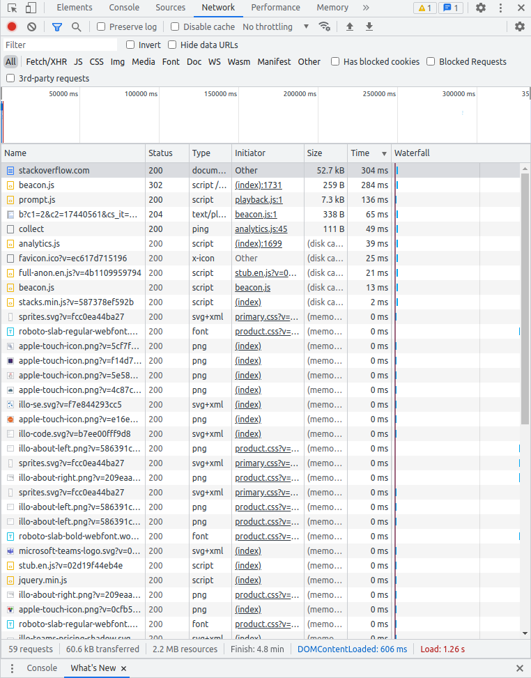
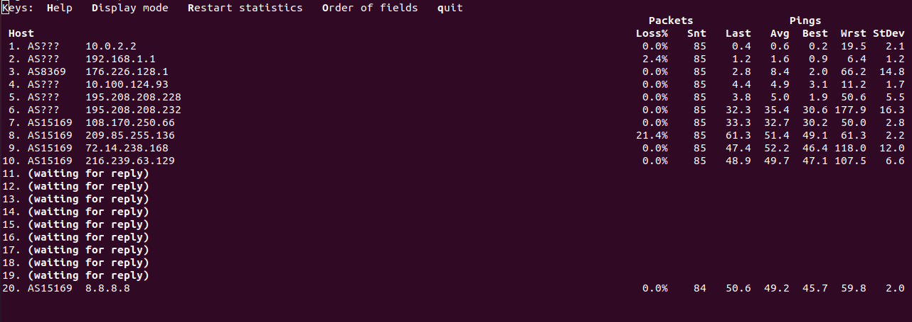

# devops-netology

## Домашнее задание к занятию "3.6. Компьютерные сети, лекция 1"

1) Результат выполнения запроса следующий

```bash
vagrant@vagrant:~$ telnet stackoverflow.com 80
Trying 151.101.1.69...
Connected to stackoverflow.com.
Escape character is '^]'.
GET /questions HTTP/1.0
HOST: stackoverflow.com

HTTP/1.1 301 Moved Permanently
cache-control: no-cache, no-store, must-revalidate
location: https://stackoverflow.com/questions
x-request-guid: ea3c47a6-ea2a-4780-b10c-98c39655b85d
feature-policy: microphone 'none'; speaker 'none'
content-security-policy: upgrade-insecure-requests; frame-ancestors 'self' https://stackexchange.com
Accept-Ranges: bytes
Date: Wed, 01 Dec 2021 20:17:24 GMT
Via: 1.1 varnish
Connection: close
X-Served-By: cache-ams21022-AMS
X-Cache: MISS
X-Cache-Hits: 0
X-Timer: S1638389844.119505,VS0,VE75
Vary: Fastly-SSL
X-DNS-Prefetch-Control: off
Set-Cookie: prov=7c3346bd-d4b9-b534-c6cf-d37265744fa8; domain=.stackoverflow.com; expires=Fri, 01-Jan-2055 00:00:00 GMT; path=/; HttpOnly

Connection closed by foreign host.
```

*HTTP/1.1 400 Bad Request* - стартовая строка ответа, в ней указывается тип (HTTP) и версия (1.1) ответа, далее код ошибки с описанием (301 Moved Permanently - сервер переехал).
Затем идут заголовки ответа такие как дата, куки, кэш, content-security-policy и т.д. Далее указано, что соединение закрыто со стороны другого хоста (в данном случае stackoverflow.com 80).

2) Выполнил запрос в браузере, с открытыми devtool. Код статуса ответа - 200. Дольше всего выполнялся как раз GET запрос https://stackoverflow.com/ - 304 мс.



3) curl ifconfig.me показывает следующий публичный ip адрес.

```bash
vagrant@vagrant:~$ curl ifconfig.me
176.226.178.35
vagrant@vagrant:~$ 
```

4) Используя команду whois -h whois.radb.net 176.226.178.35, выяснил, имя провайдера Intersvyaz-2 JSC, автономная система - AS8369.

```bash
vagrant@vagrant:~$ whois -h whois.radb.net 176.226.178.35
route:          176.226.160.0/19
descr:          Intersvyaz-2 JSC Route
org:            ORG-IJ7-RIPE
origin:         AS8369
mnt-by:         INTERSVYAS-MNT
created:        2012-02-16T09:12:02Z
last-modified:  2012-02-16T09:12:02Z
source:         RIPE
remarks:        ****************************
remarks:        * THIS OBJECT IS MODIFIED
remarks:        * Please note that all data that is generally regarded as personal
remarks:        * data has been removed from this object.
remarks:        * To view the original object, please query the RIPE Database at:
remarks:        * http://www.ripe.net/whois
remarks:        ****************************
```

5) Вывод команды traceroute -An 8.8.8.8

```bash
vagrant@vagrant:~$ traceroute -An 8.8.8.8
traceroute to 8.8.8.8 (8.8.8.8), 30 hops max, 60 byte packets
 1  192.168.1.1 [*]  1.555 ms  1.541 ms  1.524 ms
 2  176.226.128.1 [AS8369]  3.795 ms  3.774 ms  3.727 ms
 3  10.100.124.93 [*]  6.351 ms  6.334 ms  6.277 ms
 4  195.208.208.228 [AS5480]  3.581 ms  3.582 ms  3.547 ms
 5  195.208.208.232 [AS5480]  34.049 ms  34.030 ms  33.950 ms
 6  108.170.250.99 [AS15169]  33.956 ms 108.170.250.130 [AS15169]  33.411 ms 108.170.250.83 [AS15169]  30.952 ms
 7  * 142.251.49.24 [AS15169]  46.012 ms *
 8  72.14.235.69 [AS15169]  47.489 ms 108.170.235.64 [AS15169]  45.758 ms 108.170.232.251 [AS15169]  48.356 ms
 9  142.250.209.161 [AS15169]  45.746 ms 142.250.238.179 [AS15169]  46.380 ms 216.239.63.129 [AS15169]  48.186 ms
10  * * *
11  * * *
12  * * *
13  * * *
14  * * *
15  * * *
16  * * *
17  * * *
18  8.8.8.8 [AS15169]  49.292 ms * *
```

6) Наибольшая задержка на участке 6, колонка Wrst - 177.9



7) Вывод команды dig +trace @8.8.8.8 dns.google

```bash
; <<>> DiG 9.16.1-Ubuntu <<>> +trace @8.8.8.8 dns.google
; (1 server found)
;; global options: +cmd
.			77568	IN	NS	e.root-servers.net.
.			77568	IN	NS	h.root-servers.net.
.			77568	IN	NS	l.root-servers.net.
.			77568	IN	NS	i.root-servers.net.
.			77568	IN	NS	a.root-servers.net.
.			77568	IN	NS	d.root-servers.net.
.			77568	IN	NS	c.root-servers.net.
.			77568	IN	NS	b.root-servers.net.
.			77568	IN	NS	j.root-servers.net.
.			77568	IN	NS	k.root-servers.net.
.			77568	IN	NS	g.root-servers.net.
.			77568	IN	NS	m.root-servers.net.
.			77568	IN	NS	f.root-servers.net.
.			77568	IN	RRSIG	NS 8 0 518400 20211214170000 20211201160000 14748 . PEO/paqCqPUGVZ2q0uVUo5g7A/1s+Nvmfa+ZozUW5JD/PxVx3faYqD8h kM/2QsQX4MYoS1UHWtXUtPLXcoHJmtN1fe9P0Xy6wAh4nCUiwo8pwycv iTE7AakD14YTZFESM81UWNC8bdSFF3T40st9m1lmWPWDIFDoMkZR+Cd4 8en3/nyigpoeFlFa5i4T3whQNmwpYuQVQfR+EHNC535bUpr16F5xyNko CLWZRuI7pIA4dv6B5wLUOD0FS/DWGLXJYQOSS9q+rMaxfBYCEvzmf1eG 9kL8q58O1B0rEms2XhbDMuL2sqcaDZXby0hOlqdJzvKCQRP0DzLLzjUK 0MVMFg==
;; Received 525 bytes from 8.8.8.8#53(8.8.8.8) in 51 ms

google.			172800	IN	NS	ns-tld1.charlestonroadregistry.com.
google.			172800	IN	NS	ns-tld2.charlestonroadregistry.com.
google.			172800	IN	NS	ns-tld3.charlestonroadregistry.com.
google.			172800	IN	NS	ns-tld4.charlestonroadregistry.com.
google.			172800	IN	NS	ns-tld5.charlestonroadregistry.com.
google.			86400	IN	DS	6125 8 2 80F8B78D23107153578BAD3800E9543500474E5C30C29698B40A3DB2 3ED9DA9F
google.			86400	IN	RRSIG	DS 8 1 86400 20211214170000 20211201160000 14748 . RO+hi4FQZxyeR4k3nAQtq3vqnh4bvMU3VRpBJoyh6OYsZYsCCzj3Rqr/ qkyXrcVBKX8QfWH3pTZQPE3WWUK8JBIR601EWoJDMK68jiq52bq0s80F 7MujOdNMFJFfDEImLSwkHLWL9+YCHidBhDeQ23trC7nEpxjsEcSLSinS FRJtjTKnCGGvukWMxZ+Yn4HDZ7z/iu7PKhHEGis6roOHdVl9Rt4TUMxl JFMjKPCTcjJkB9fEcS1/seNq2vikS73hITSET/iygD1bcBzWrO4/0LQD Hnwh3YjhJ1cEUndV2AU6Xa9ZqbnpWHDXWHQQVhhmMSKqkKo0QZPHg4y+ YZk+kg==
;; Received 730 bytes from 192.203.230.10#53(e.root-servers.net) in 24 ms

dns.google.		10800	IN	NS	ns3.zdns.google.
dns.google.		10800	IN	NS	ns2.zdns.google.
dns.google.		10800	IN	NS	ns4.zdns.google.
dns.google.		10800	IN	NS	ns1.zdns.google.
dns.google.		3600	IN	DS	56044 8 2 1B0A7E90AA6B1AC65AA5B573EFC44ABF6CB2559444251B997103D2E4 0C351B08
dns.google.		3600	IN	RRSIG	DS 8 2 3600 20211221073057 20211129073057 8830 google. 3gzis3UAc1P3Gapan3nCPNxIXXcTirligYTysMIAJxXY4QXDlAtjsx28 RQ1XoNWkkWCGRAMZBR3YYoWJD3gDCJeDtxAdPTMlb7rx3F1pw2oUtcdQ Yor4PjISZ8Z7uK7VhWSx7cR5IqpmGvN2CeXpjv2XJdH2J89jjudCgWzU 5g0=
;; Received 506 bytes from 216.239.32.105#53(ns-tld1.charlestonroadregistry.com) in 79 ms

dns.google.		900	IN	A	8.8.4.4
dns.google.		900	IN	A	8.8.8.8
dns.google.		900	IN	RRSIG	A 8 2 900 20211231160941 20211201160941 1773 dns.google. HYV/3wSxb3Ki76gAR/u2IWKqM4drGbWyMvGArZMhbe6A4qLeV8q/APMS Cats/+flbjJ4XGaM6eMvJ/nDVsEWkFE+4/EMwIUgBzPf5ppPtBoS3/mk 8GNZ1RL7Gp6vgY7ignhS4EtKGaSHh0VZ0dzcv+ijEAgeXaMICiPhA0tT 2SA=
;; Received 241 bytes from 216.239.38.114#53(ns4.zdns.google) in 71 ms

```

Корневые серверы идут с точкой. Далее, если я верно понял, идут серверы google, потом dns.google. А записи в данном случае это 

```text
dns.google.		900	IN	A	8.8.4.4
dns.google.		900	IN	A	8.8.8.8
```

8) Доменное имя - 8.8.8.8.in-addr.arpa.

```bash
vagrant@vagrant:~$ dig -x 8.8.8.8

; <<>> DiG 9.16.1-Ubuntu <<>> -x 8.8.8.8
;; global options: +cmd
;; Got answer:
;; ->>HEADER<<- opcode: QUERY, status: NOERROR, id: 33672
;; flags: qr rd ra; QUERY: 1, ANSWER: 1, AUTHORITY: 0, ADDITIONAL: 1

;; OPT PSEUDOSECTION:
; EDNS: version: 0, flags:; udp: 65494
;; QUESTION SECTION:
;8.8.8.8.in-addr.arpa.		IN	PTR

;; ANSWER SECTION:
8.8.8.8.in-addr.arpa.	5553	IN	PTR	dns.google.

;; Query time: 0 msec
;; SERVER: 127.0.0.53#53(127.0.0.53)
;; WHEN: Wed Dec 01 20:09:14 UTC 2021
;; MSG SIZE  rcvd: 73

```