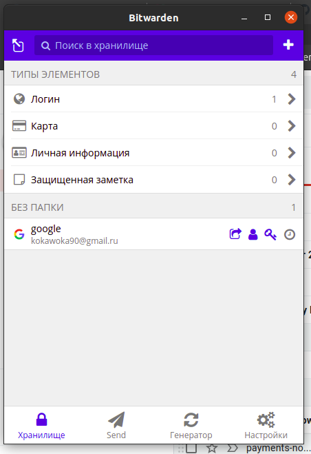
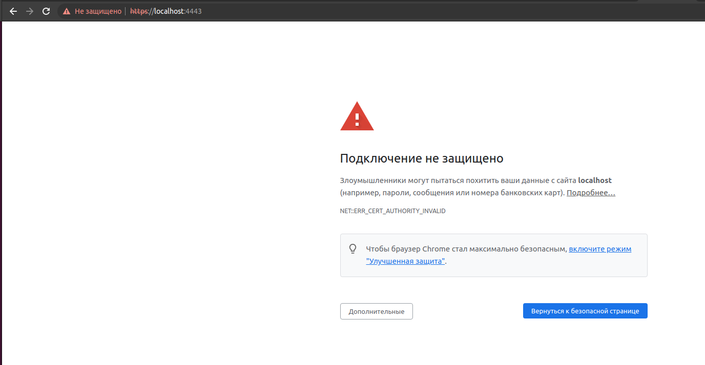
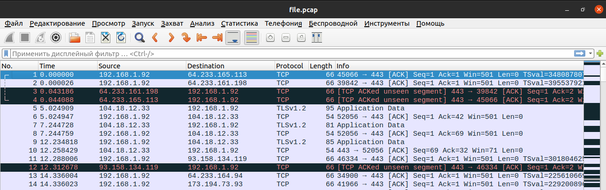

# devops-netology

## Домашнее задание к занятию "3.9. Элементы безопасности информационных систем"

1) Выполнено.



2) Выполнено.
3) Выполнено. Устанавливаем apache2 включаем ssl mode, перезапускаем сервер.

```bash
vagrant@vagrant:~$ sudo apt install apache2
vagrant@vagrant:~$ sudo a2enmod ssl
vagrant@vagrant:~$ sudo systemctl restart apache2
```

Создаем сертификаты для тестового сайта

```bash
vagrant@vagrant:~$ sudo openssl req -x509 -nodes -days 365 -newkey rsa:2048 \
> -keyout /etc/ssl/private/apache-selfsigned.key \
> -out /etc/ssl/certs/apache-selfsigned.crt \
> -subj "/C=RU/ST=Moscow/L=Moscow/O=Company Name/OU=Org/CN=www.example-test.com"
Generating a RSA private key
...........................................................................+++++
..................................................................................................................................................................................+++++
writing new private key to '/etc/ssl/private/apache-selfsigned.key'
-----
```

Создаем файл конфига www.exampletesttest.com.conf.

```bash
vagrant@vagrant:~$ sudo nano /etc/apache2/sites-available/www.example-test.com.conf
```

и добавляем настройки сервера.

```bash
<IfModule mod_ssl.c>
<VirtualHost *:443>
        ServerName www.example-test.com
        ServerAlias www.example-test.com
        ServerAdmin admin@example-test.com

        DocumentRoot /var/www/example-test.com/html

        ErrorLog /var/www/example-test.com/logs/error.log
        CustomLog /var/www/example-test.com/logs/access.log combined

        SSLCertificateFile /etc/ssl/certs/apache-selfsigned.crt
        SSLCertificateKeyFile /etc/ssl/private/apache-selfsigned.key
</VirtualHost>
</IfModule>
```

Создадим простейший html файл.

```bash
vagrant@vagrant:~$ sudo mkdir /var/www/example-test.com
vagrant@vagrant:~$ sudo mkdir /var/www/example-test.com/logs
vagrant@vagrant:~$ sudo touch /var/www/example-test.com/logs/error.log
vagrant@vagrant:~$ sudo touch /var/www/example-test.com/logs/access.log
vagrant@vagrant:~$ sudo mkdir /var/www/example-test.com/html
vagrant@vagrant:~$ sudo nano /var/www/example-test.com/index.html
```

Добавим в него следующее содержимое

```html
<h1>it worked!</h1>
```

Дополнительно, перед этим необходимо отключить сайт по-умолчанию, в противном случае, тестовый сайт не отобразиться.

```bash
vagrant@vagrant:~$ a2dissite 000-default.conf
vagrant@vagrant:~$ a2dissite default-ssl.conf
```

Далее, выполним команды

```bash
vagrant@vagrant:~$ sudo a2ensite www.example-test.com.conf
Enabling site example123321.com.
To activate the new configuration, you need to run:
  systemctl reload apache2

vagrant@vagrant:~$ sudo apache2ctl configtest
Syntax OK
vagrant@vagrant:~$ sudo systemctl reload apache2
```

Также в Vagrantfile пробрасываем порт 443 на хостовую машину (вместо 443 порта пробросил на 4443, т.к. для 443 в браузере выводилась ошибка подключения)

```text
config.vm.network "forwarded_port", guest:443, host:4443
```
Результат.




4) Выполнено. Склонировал репозиторий из гитхаба (https://github.com/drwetter/testssl.sh.git). Далее, командой ./testssl.sh -U --sneaky https://www.google.com/ проводим тест на выявление уязвимости для www.google.com.
Результаты одного из последних тестов.

```text
 Testing vulnerabilities 

 Heartbleed (CVE-2014-0160)                not vulnerable (OK), no heartbeat extension
 CCS (CVE-2014-0224)                       not vulnerable (OK)
 Ticketbleed (CVE-2016-9244), experiment.  not vulnerable (OK)
 ROBOT                                     not vulnerable (OK)
 Secure Renegotiation (RFC 5746)           supported (OK)
 Secure Client-Initiated Renegotiation     not vulnerable (OK)
 CRIME, TLS (CVE-2012-4929)                not vulnerable (OK)
 BREACH (CVE-2013-3587)                    potentially NOT ok, "br gzip" HTTP compression detected. - only supplied "/" tested
                                           Can be ignored for static pages or if no secrets in the page
 POODLE, SSL (CVE-2014-3566)               not vulnerable (OK)
 TLS_FALLBACK_SCSV (RFC 7507)              Downgrade attack prevention supported (OK)
 SWEET32 (CVE-2016-2183, CVE-2016-6329)    VULNERABLE, uses 64 bit block ciphers
 FREAK (CVE-2015-0204)                     not vulnerable (OK)
 DROWN (CVE-2016-0800, CVE-2016-0703)      not vulnerable on this host and port (OK)
                                           make sure you don't use this certificate elsewhere with SSLv2 enabled services
                                           https://censys.io/ipv4?q=0298F617D11DA008B87DC59F932885BF2108F97C605E48E6AB166170610B39D7 could help you to find out
 LOGJAM (CVE-2015-4000), experimental      not vulnerable (OK): no DH EXPORT ciphers, no DH key detected with <= TLS 1.2
 BEAST (CVE-2011-3389)                     TLS1: ECDHE-ECDSA-AES128-SHA ECDHE-ECDSA-AES256-SHA ECDHE-RSA-AES128-SHA ECDHE-RSA-AES256-SHA
                                                 AES128-SHA AES256-SHA DES-CBC3-SHA 
                                           VULNERABLE -- but also supports higher protocols  TLSv1.1 TLSv1.2 (likely mitigated)
 LUCKY13 (CVE-2013-0169), experimental     potentially VULNERABLE, uses cipher block chaining (CBC) ciphers with TLS. Check patches
 Winshock (CVE-2014-6321), experimental    not vulnerable (OK)
 RC4 (CVE-2013-2566, CVE-2015-2808)        no RC4 ciphers detected (OK)
```

5) Выполнено. Предварительно задал в Vagrantfile ip-адрес (config.vm.network "public_network", ip: "192.168.1.10").

```bash
vagrant@vagrant:~$ sudo apt install openssh-server -y
vagrant@vagrant:~$ systemctl enable ssh
Synchronizing state of ssh.service with SysV service script with /lib/systemd/systemd-sysv-install.
Executing: /lib/systemd/systemd-sysv-install enable ssh
vagrant@vagrant:~$ systemctl start ssh
vagrant@vagrant:~$ ssh-keygen

vagrant@vagrant:~$ ssh-copy-id vagrant@192.168.1.10

The authenticity of host '192.168.1.10 (192.168.1.10)' can't be established.
ECDSA key fingerprint is SHA256:wSHl+h4vAtTT7mbkj2lbGyxWXWTUf6VUliwpncjwLPM.
Are you sure you want to continue connecting (yes/no/[fingerprint])? yes
/usr/bin/ssh-copy-id: INFO: attempting to log in with the new key(s), to filter out any that are already installed
/usr/bin/ssh-copy-id: INFO: 2 key(s) remain to be installed -- if you are prompted now it is to install the new keys
vagrant@192.168.1.10's password: 

Number of key(s) added: 2

Now try logging into the machine, with:   "ssh 'vagrant@192.168.1.10'"
and check to make sure that only the key(s) you wanted were added.
vagrant@vagrant:~$ ssh 'vagrant@192.168.1.10'
```

6) Выполнено.

```bash
constantine@constantine:~$ cd .ssh
constantine@constantine:~/.ssh$ mv id_rsa vagrant_key && mv id_rsa.pub vagrant_key.pub
constantine@constantine:~/.ssh$ touch ~/.ssh/config && chmod 700 ~/.ssh/config
constantine@constantine:~/.ssh$ sudo nano ~/.ssh/config
```

Добавляем в конфиг следующий блок

```text
Host vagrant
    HostName 192.168.1.10
    User vagrant
    IdentityFile ~/.ssh/vagrant_key
```

После этого вводим ssh vagrant и далее passphrase.

7) Выполнено.

```bash
constantine@constantine:~$ sudo tcpdump -D
constantine@constantine:~$ sudo tcpdump -w file.pcap -c 100 -i wlp2s0
```

