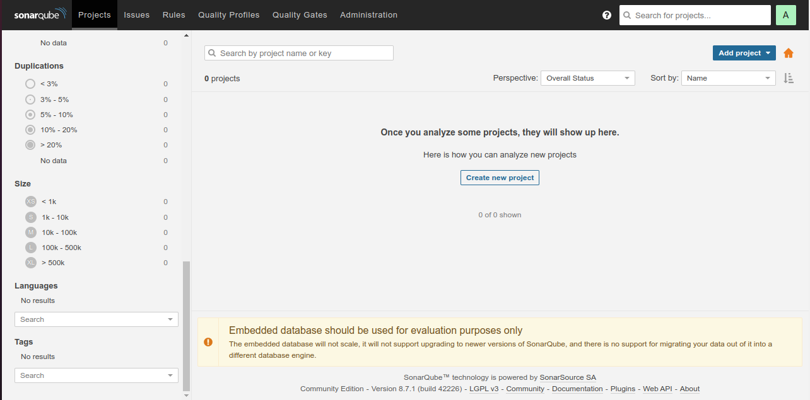
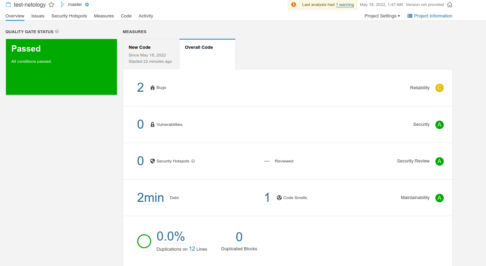
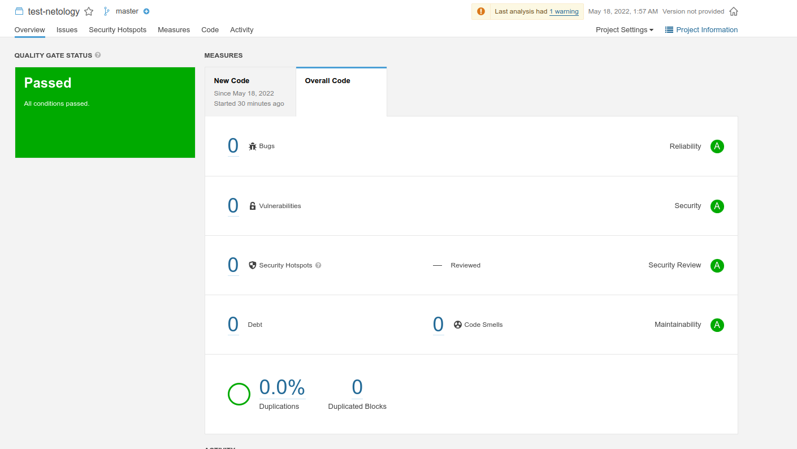
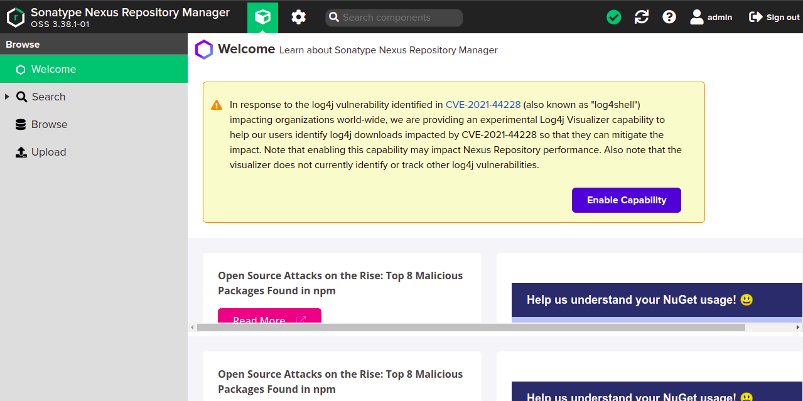
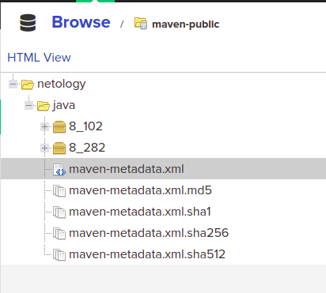

# devops-netology

## Домашнее задание к занятию "09.02 CI\CD"

### Знакомство с SonarQube

#### Подготовка к выполнению

Выполнено. SonarQube запущен по адресу localhost:9000.

#### Основная часть

Выполнено. После анализа кода в интерфейсе выведены результаты (2 бага и 1 code smells)

После исправления багов и повторного анализа ошибок найдено не было.

### Знакомство с Nexus

#### Подготовка к выполнению

Выполнено. Пароль был изменен, анонимный доступ сохранен.

#### Основная часть

Выполнено. Артефакты успешно загружены.

Файл `maven-metadata.xml` приложен к дом. заданию.

### Знакомство с Maven

#### Подготовка к выполнению

Выполнено. Установлена версия Apache Maven 3.6.3

#### Основная часть

Выполнено. После выполнения mvn install артефакт появился в ~/.m2/repository/. Исправленный `pom.xml` приложен к дом. заданию.
