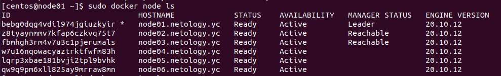
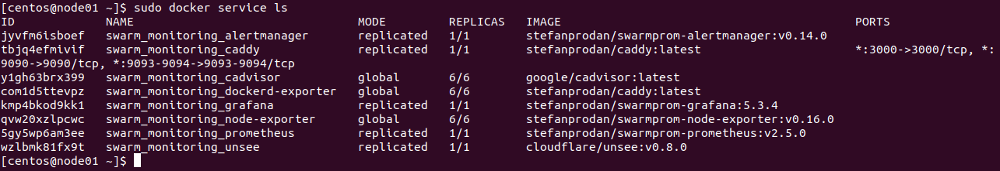

# devops-netology

## Домашнее задание к занятию "5.5. Оркестрация кластером Docker контейнеров на примере Docker Swarm"

1) Выполнено.
* В чём отличие режимов работы сервисов в Docker Swarm кластере: replication и global?
В режиме replication на каждой ноде развертывается указанное количество реплик, указанных флагом --replicas при создании или обновлении сервиса. В режиме global на каждой ноде создается своя реплика, т.е количество реплик == количеству нод.
* Какой алгоритм выбора лидера используется в Docker Swarm кластере?
Для выбора лидера используется алгоритм RAFT
* Что такое Overlay Network?
Overlay network - это компьютерная сеть, которая расположена поверх другой сети. Узлы оверлейной сети могут быть связаны либо физическим соединением, либо логическим, для которого в основной сети существуют один или несколько соответствующих маршрутов из физических соединений. Примером такой сети можно назвать VPN сеть.

2) Выполнено.

3) Выполнено.

4) docker swarm update --autolock=true - команда обновляет текущие управляющие и рабочие ноды с включением режима автоблокировки. 
При таком режиме отсутствует какая-либо возможность управления узлами и сервисами без введения специального ключа. Соответственно, флаг --autolock=false отключает автоблокировку.