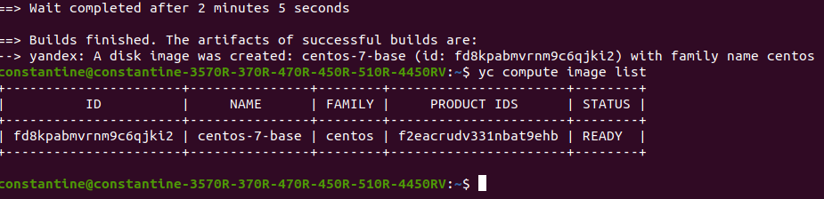
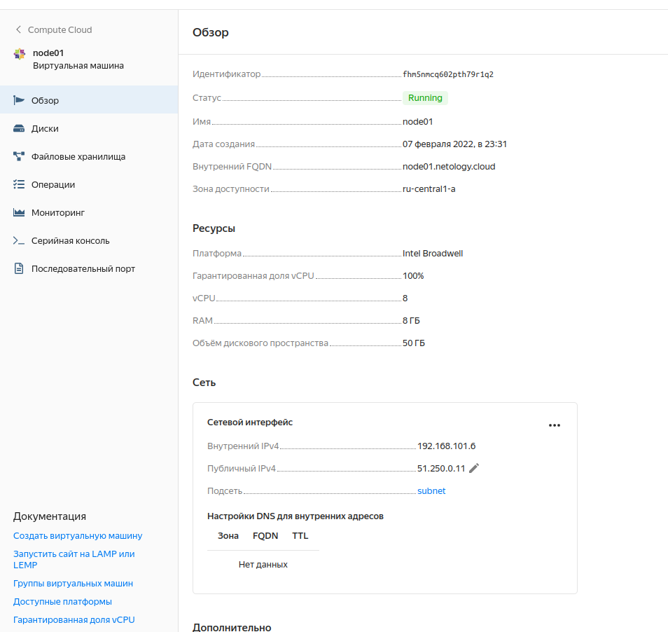
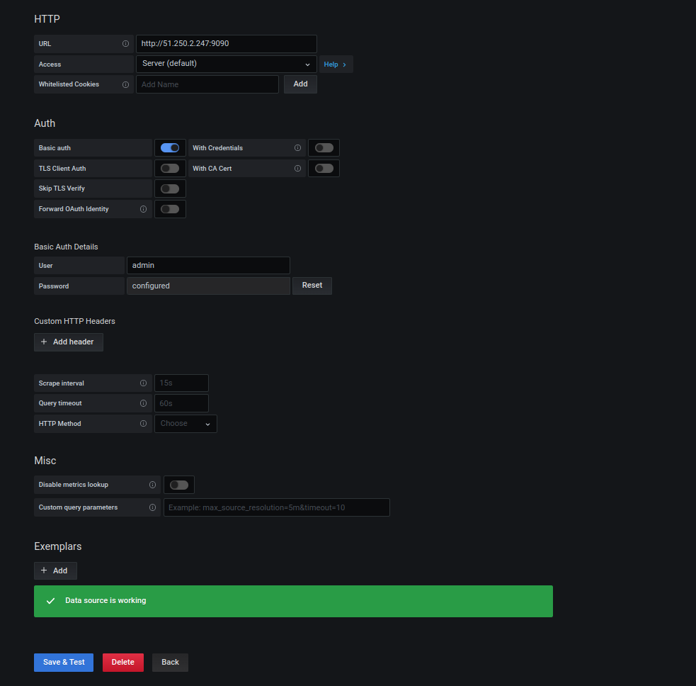
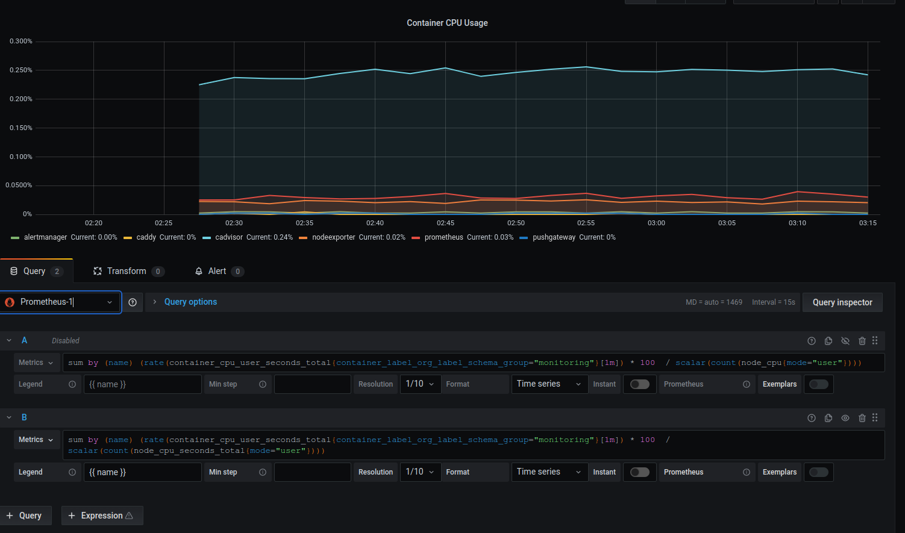

# devops-netology

## Домашнее задание к занятию "5.4. Оркестрация группой Docker контейнеров на примере Docker Compose"

1) Выполнено.

2) Выполнено.

3) Выполнено.

4) Выполнено.
Добавил конфиг node02.tf для второй машины и создал обе через terraform apply, получив ip-адреса созданных машин.
Для первой playbook запустил без изменений, для второй убрал сборку и запуск контейнера графаны, т.к. он не нужен.
Работа prometheus на втором контейнере

Добавим новый datasource (либо через конфиг datasource.yml, либо через UI)

Добавим новый дашборд или изменим старый (решил воспользоваться вторым вариантом). Новый datasource доступен в списке доступных. Сохраняем изменения и начинаем получать метрики со второй машины

