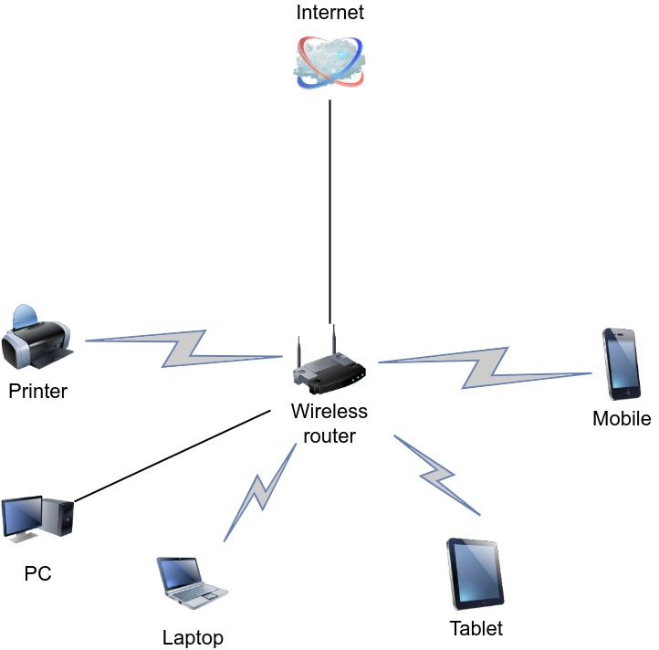

# devops-netology

## Домашнее задание к занятию "3.8. Компьютерные сети, лекция 3"

1) Выполнено.

```bash
vagrant@vagrant:~$ curl ifconfig.me
176.226.178.35
vagrant@vagrant:~$ telnet route-views.routeviews.org
Trying 128.223.51.103...
Connected to route-views.routeviews.org.
Escape character is '^]'.
C
**********************************************************************

                    RouteViews BGP Route Viewer
                    route-views.routeviews.org

 route views data is archived on http://archive.routeviews.org

 This hardware is part of a grant by the NSF.
 Please contact help@routeviews.org if you have questions, or
 if you wish to contribute your view.

 This router has views of full routing tables from several ASes.
 The list of peers is located at http://www.routeviews.org/peers
 in route-views.oregon-ix.net.txt

 NOTE: The hardware was upgraded in August 2014.  If you are seeing
 the error message, "no default Kerberos realm", you may want to
 in Mac OS X add "default unset autologin" to your ~/.telnetrc

 To login, use the username "rviews".

 **********************************************************************


User Access Verification

Username: rviews

route-views>show ip route 176.226.178.35   
Routing entry for 176.226.128.0/17
  Known via "bgp 6447", distance 20, metric 0
  Tag 6939, type external
  Last update from 64.71.137.241 01:54:01 ago
  Routing Descriptor Blocks:
  * 64.71.137.241, from 64.71.137.241, 01:54:01 ago
      Route metric is 0, traffic share count is 1
      AS Hops 3
      Route tag 6939
      MPLS label: none

route-views>show bgp 176.226.128.0         
BGP routing table entry for 176.226.128.0/17, version 1400023420
Paths: (24 available, best #23, table default)
  Not advertised to any peer
  Refresh Epoch 1
  2497 174 31133 8369
    202.232.0.2 from 202.232.0.2 (58.138.96.254)
      Origin incomplete, localpref 100, valid, external
      path 7FE080A39BC0 RPKI State not found
      rx pathid: 0, tx pathid: 0
  Refresh Epoch 1
  3267 31133 8369
    194.85.40.15 from 194.85.40.15 (185.141.126.1)
      Origin incomplete, metric 0, localpref 100, valid, external
      path 7FE0C1B1A400 RPKI State not found
      rx pathid: 0, tx pathid: 0
  Refresh Epoch 1
  20912 3257 174 31133 8369
    212.66.96.126 from 212.66.96.126 (212.66.96.126)
      Origin incomplete, localpref 100, valid, external
      Community: 3257:8070 3257:30155 3257:50001 3257:53900 3257:53902 20912:65004
      path 7FE0CD3102C0 RPKI State not found
      rx pathid: 0, tx pathid: 0
  Refresh Epoch 1
  7018 1299 31133 8369
    12.0.1.63 from 12.0.1.63 (12.0.1.63)
      Origin incomplete, localpref 100, valid, external
      Community: 7018:5000 7018:37232
      path 7FE0DA3AB970 RPKI State not found
      rx pathid: 0, tx pathid: 0
  Refresh Epoch 3
  3303 50384 8369
    217.192.89.50 from 217.192.89.50 (138.187.128.158)
      Origin IGP, localpref 100, valid, external
      Community: 3303:1004 3303:1006 3303:1030 3303:1031 3303:3081 31210:50384 65005:10643
      path 7FE054C80100 RPKI State not found
      rx pathid: 0, tx pathid: 0
  Refresh Epoch 1
```

2) Есть по крайней мере 2 способа создать dummy интерфейс. Первый - использование конфигурации 

```bash
root@vagrant:~# echo "dummy" >> /etc/modules
root@vagrant:~# echo "options dummy numdummies=2" > /etc/modprobe.d/dummy.conf
```

Далее, добавляем в файл /etc/network/interfaces следующую конфигурацию

```text
auto dummy0
iface dummy0 inet static
    address 10.2.2.2/32
    pre-up ip link add dummy0 type dummy
    post-down ip link del dummy0
```

после чего, перезагружаем систему. Также, есть возможность создать интерфейс, используя утилиту ip

```bash
vagrant@vagrant:~$ sudo -i
root@vagrant:~# ip link add dummy0 type dummy
root@vagrant:~# ip addr add 192.168.98.1/24 dev dummy0
root@vagrant:~# ip addr add 192.168.99.1/24 dev dummy0
root@vagrant:~# ip link set dummy0 up
root@vagrant:~# ip route
default via 10.0.2.2 dev eth0 proto dhcp src 10.0.2.15 metric 100 
10.0.2.0/24 dev eth0 proto kernel scope link src 10.0.2.15 
10.0.2.2 dev eth0 proto dhcp scope link src 10.0.2.15 metric 100 
192.168.98.0/24 dev dummy0 proto kernel scope link src 192.168.98.1 
192.168.99.0/24 dev dummy0 proto kernel scope link src 192.168.99.1 
```
и соответственно видно, что маршруты успешно созданы.

3) Выполнено, используя netstat

```bash
root@vagrant:~# netstat -ntlp | grep LISTEN
tcp        0      0 127.0.0.53:53           0.0.0.0:*               LISTEN      556/systemd-resolve 
tcp        0      0 0.0.0.0:22              0.0.0.0:*               LISTEN      780/sshd: /usr/sbin 
tcp        0      0 0.0.0.0:111             0.0.0.0:*               LISTEN      1/init              
tcp6       0      0 :::22                   :::*                    LISTEN      780/sshd: /usr/sbin 
tcp6       0      0 :::111                  :::*                    LISTEN      1/init  
```
В данном случае используются протоколы tcp и tcp6. Программы в списке это /sbin/init (символическая ссылка на /lib/systemd/systemd), init - это если я правильно понял, процесс инициализации
виртуальной машины и sshd - это подключение по ssh к телетайпу, systemd-resolve — служба systemd, выполняющая разрешение сетевых имён для локальных приложений посредством D-Bus, NSS-службы resolve 

4) Выполнено, также используя netstat

```bash
root@vagrant:~# netstat -nplu
Active Internet connections (only servers)
Proto Recv-Q Send-Q Local Address           Foreign Address         State       PID/Program name    
udp        0      0 127.0.0.53:53           0.0.0.0:*                           556/systemd-resolve 
udp        0      0 10.0.2.15:68            0.0.0.0:*                           398/systemd-network 
udp        0      0 0.0.0.0:111             0.0.0.0:*                           1/init              
udp6       0      0 :::111                  :::*                                1/init 
```
В данном случае используются протоколы udp и udp6. Программы из списка systemd-resolve — служба systemd, выполняющая разрешение сетевых имён для локальных приложений посредством D-Bus, NSS-службы resolve,
systemd-network — системный демон для управления сетевыми настройками, init - процесс инициализации виртуальной машины.

5) Выполнено, правда сеть получилась совсем маленькая)

