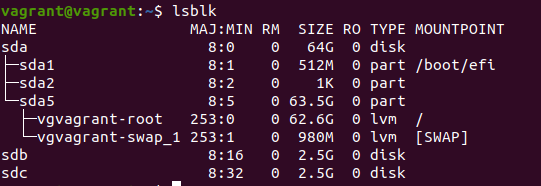
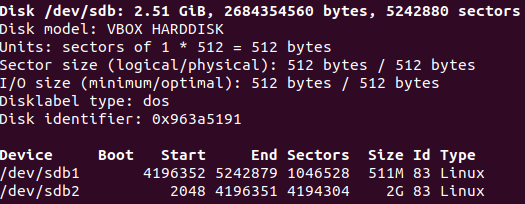
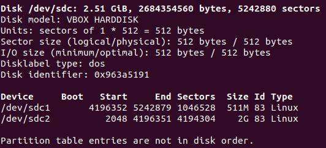

# devops-netology

## Домашнее задание к занятию "3.5. Файловые системы"

1) Изучил.
2) Жесткая ссылка и файл, для которой она создавалась, имеют одинаковые inode. Поэтому жесткая ссылка имеет те же права доступа, владельца и время последней модификации, что и целевой файл.
Пример:

```bash
vagrant@vagrant:~$ echo "123" > test.txt
vagrant@vagrant:~$ ln test.txt test_hl
vagrant@vagrant:~$ ls -l | grep test
-rw-rw-r-- 2 vagrant vagrant    4 Nov 17 20:46 test_hl
-rw-rw-r-- 2 vagrant vagrant    4 Nov 17 20:46 test.txt
vagrant@vagrant:~$ sudo chown root test_hl
vagrant@vagrant:~$ ls -l | grep test
-rw-rw-r-- 3 root    vagrant    4 Nov 17 20:46 test_hl
-rw-rw-r-- 3 root    vagrant    4 Nov 17 20:46 test.txt
vagrant@vagrant:~$ sudo chmod 777 test_hl
vagrant@vagrant:~$ ls -l | grep test
-rwxrwxrwx 3 root    vagrant    4 Nov 17 20:46 test_hl
-rwxrwxrwx 3 root    vagrant    4 Nov 17 20:46 test.txt
```

Таким, образом, меняя владельца и права доступа для файла или жесткой ссылки, мы меняем их в первую очередь для inode.

3) Выполнил.



4) Выполнено.



5) Пришлось использовать sudo -i, т.к. без него доступ до sdc запрещен. Далее, sfdisk -d /dev/sdb | sfdisk /dev/sdc



6) Выполнено.

```bash
vagrant@vagrant:~$ sudo mdadm --create --verbose /dev/md1 --level=1 --raid-devices=2 /dev/sdb2 /dev/sdc2
mdadm: Note: this array has metadata at the start and
    may not be suitable as a boot device.  If you plan to
    store '/boot' on this device please ensure that
    your boot-loader understands md/v1.x metadata, or use
    --metadata=0.90
mdadm: size set to 2094080K
Continue creating array? y
mdadm: Defaulting to version 1.2 metadata
mdadm: array /dev/md1 started.
vagrant@vagrant:~$ cat /proc/mdstat
Personalities : [linear] [multipath] [raid0] [raid1] [raid6] [raid5] [raid4] [raid10] 
md1 : active raid1 sdc2[1] sdb2[0]
      2094080 blocks super 1.2 [2/2] [UU]
      
unused devices: <none>
```

7) Выполнено.

```bash
vagrant@vagrant:~$ sudo mdadm --create --verbose /dev/md2 --level=0 --raid-devices=2 /dev/sdb1 /dev/sdc1
mdadm: chunk size defaults to 512K
mdadm: Defaulting to version 1.2 metadata
mdadm: array /dev/md2 started.
vagrant@vagrant:~$ cat /proc/mdstat
Personalities : [linear] [multipath] [raid0] [raid1] [raid6] [raid5] [raid4] [raid10] 
md2 : active raid0 sdc1[1] sdb1[0]
      1042432 blocks super 1.2 512k chunks
      
md1 : active raid1 sdc2[1] sdb2[0]
      2094080 blocks super 1.2 [2/2] [UU]
      
unused devices: <none>
```

8) Выполнено.

```bash
vagrant@vagrant:~$ sudo pvcreate /dev/md1 /dev/md2
  Physical volume "/dev/md1" successfully created.
  Physical volume "/dev/md2" successfully created.
```

9) Выполнено.

```bash
vagrant@vagrant:~$ sudo vgcreate vg1 /dev/md1 /dev/md2
  Volume group "vg1" successfully created
  
vagrant@vagrant:~$ sudo vgdisplay
  --- Volume group ---
  VG Name               vgvagrant
  System ID             
  Format                lvm2
  Metadata Areas        1
  Metadata Sequence No  3
  VG Access             read/write
  VG Status             resizable
  MAX LV                0
  Cur LV                2
  Open LV               2
  Max PV                0
  Cur PV                1
  Act PV                1
  VG Size               <63.50 GiB
  PE Size               4.00 MiB
  Total PE              16255
  Alloc PE / Size       16255 / <63.50 GiB
  Free  PE / Size       0 / 0   
  VG UUID               PaBfZ0-3I0c-iIdl-uXKt-JL4K-f4tT-kzfcyE
   
  --- Volume group ---
  VG Name               vg1
  System ID             
  Format                lvm2
  Metadata Areas        2
  Metadata Sequence No  1
  VG Access             read/write
  VG Status             resizable
  MAX LV                0
  Cur LV                0
  Open LV               0
  Max PV                0
  Cur PV                2
  Act PV                2
  VG Size               <2.99 GiB
  PE Size               4.00 MiB
  Total PE              765
  Alloc PE / Size       0 / 0   
  Free  PE / Size       765 / <2.99 GiB
  VG UUID               DT4YRa-A6Qe-eG28-3oHo-ixGM-MZER-EIbThQ

```

10) Выполнено.

```bash
vagrant@vagrant:~$ sudo lvcreate -n lv1 -L 100M vg1 /dev/md2
  Logical volume "lv1" created.
  
root@vagrant:~# vgs
  VG        #PV #LV #SN Attr   VSize   VFree
  vg1         2   1   0 wz--n-  <2.99g 2.89g
  vgvagrant   1   2   0 wz--n- <63.50g    0 
root@vagrant:~# lvs
  LV     VG        Attr       LSize   Pool Origin Data%  Meta%  Move Log Cpy%Sync Convert
  lv1    vg1       -wi-a----- 100.00m                                                    
  root   vgvagrant -wi-ao---- <62.54g                                                    
  swap_1 vgvagrant -wi-ao---- 980.00m  
```

11) Выполнено.

```bash
root@vagrant:~# mkfs.ext4 /dev/vg1/lv1
mke2fs 1.45.5 (07-Jan-2020)
Creating filesystem with 25600 4k blocks and 25600 inodes

Allocating group tables: done                            
Writing inode tables: done                            
Creating journal (1024 blocks): done
Writing superblocks and filesystem accounting information: done

```

12) Выполнено.

```bash
root@vagrant:~# mkdir /tmp/new
root@vagrant:~# mount /dev/vg1/lv1 /tmp/new

```

13) Выполнено.

```bash
root@vagrant:/# wget https://mirror.yandex.ru/ubuntu/ls-lR.gz -O /tmp/new/test.gz
root@vagrant:/# ls -l /tmp/new
total 22048
-rw-r--r-- 1 root root 22574425 Nov 29 09:55 test.gz

```

14) Выполнено.

```bash
root@vagrant:/# lsblk
NAME                 MAJ:MIN RM  SIZE RO TYPE  MOUNTPOINT
sda                    8:0    0   64G  0 disk  
├─sda1                 8:1    0  512M  0 part  /boot/efi
├─sda2                 8:2    0    1K  0 part  
└─sda5                 8:5    0 63.5G  0 part  
  ├─vgvagrant-root   253:0    0 62.6G  0 lvm   /
  └─vgvagrant-swap_1 253:1    0  980M  0 lvm   [SWAP]
sdb                    8:16   0  2.5G  0 disk  
├─sdb1                 8:17   0  511M  0 part  
│ └─md2                9:2    0 1018M  0 raid0 
│   └─vg1-lv1        253:2    0  100M  0 lvm   /tmp/new
└─sdb2                 8:18   0    2G  0 part  
  └─md1                9:1    0    2G  0 raid1 
sdc                    8:32   0  2.5G  0 disk  
├─sdc1                 8:33   0  511M  0 part  
│ └─md2                9:2    0 1018M  0 raid0 
│   └─vg1-lv1        253:2    0  100M  0 lvm   /tmp/new
└─sdc2                 8:34   0    2G  0 part  
  └─md1                9:1    0    2G  0 raid1 
```

15) Выполнено.

```bash
root@vagrant:/# gzip -t /tmp/new/test.gz
root@vagrant:/# echo $?
0

```

16) Выполнено.

```bash
root@vagrant:/# pvmove /dev/md2 /dev/md1
  /dev/md2: Moved: 12.00%
  /dev/md2: Moved: 100.00%
root@vagrant:/# lsblk
NAME                 MAJ:MIN RM  SIZE RO TYPE  MOUNTPOINT
sda                    8:0    0   64G  0 disk  
├─sda1                 8:1    0  512M  0 part  /boot/efi
├─sda2                 8:2    0    1K  0 part  
└─sda5                 8:5    0 63.5G  0 part  
  ├─vgvagrant-root   253:0    0 62.6G  0 lvm   /
  └─vgvagrant-swap_1 253:1    0  980M  0 lvm   [SWAP]
sdb                    8:16   0  2.5G  0 disk  
├─sdb1                 8:17   0  511M  0 part  
│ └─md2                9:2    0 1018M  0 raid0 
└─sdb2                 8:18   0    2G  0 part  
  └─md1                9:1    0    2G  0 raid1 
    └─vg1-lv1        253:2    0  100M  0 lvm   /tmp/new
sdc                    8:32   0  2.5G  0 disk  
├─sdc1                 8:33   0  511M  0 part  
│ └─md2                9:2    0 1018M  0 raid0 
└─sdc2                 8:34   0    2G  0 part  
  └─md1                9:1    0    2G  0 raid1 
    └─vg1-lv1        253:2    0  100M  0 lvm   /tmp/new

```

17) Выполнено.

```bash
root@vagrant:/# mdadm /dev/md1 --fail /dev/sdc2
mdadm: set /dev/sdc2 faulty in /dev/md1
root@vagrant:/# mdadm --detail /dev/md1
/dev/md1:
           Version : 1.2
     Creation Time : Mon Nov 29 20:18:25 2021
        Raid Level : raid1
        Array Size : 2094080 (2045.00 MiB 2144.34 MB)
     Used Dev Size : 2094080 (2045.00 MiB 2144.34 MB)
      Raid Devices : 2
     Total Devices : 2
       Persistence : Superblock is persistent

       Update Time : Mon Nov 29 21:34:10 2021
             State : clean, degraded 
    Active Devices : 1
   Working Devices : 1
    Failed Devices : 1
     Spare Devices : 0

Consistency Policy : resync

              Name : vagrant:1  (local to host vagrant)
              UUID : 76238aa4:d7e8a338:0a1724b8:10bfa3b0
            Events : 19

    Number   Major   Minor   RaidDevice State
       0       8       18        0      active sync   /dev/sdb2
       -       0        0        1      removed

       1       8       34        -      faulty   /dev/sdc2
```

18) Выполнено.

```bash
root@vagrant:/# dmesg | grep sdc
[    2.681188] sd 4:0:0:0: [sdc] 5242880 512-byte logical blocks: (2.68 GB/2.50 GiB)
[    2.681202] sd 4:0:0:0: [sdc] Write Protect is off
[    2.681204] sd 4:0:0:0: [sdc] Mode Sense: 00 3a 00 00
[    2.681225] sd 4:0:0:0: [sdc] Write cache: enabled, read cache: enabled, doesn't support DPO or FUA
[    3.361283] sd 4:0:0:0: [sdc] Attached SCSI disk
[ 1925.296420]  sdc: sdc1 sdc2
[ 7199.238416] md/raid1:md1: Disk failure on sdc2, disabling device.
```

19) Выполнено.

```bash
root@vagrant:/# gzip -t /tmp/new/test.gz
root@vagrant:/# echo $?
0

```

20) Выполнено.
