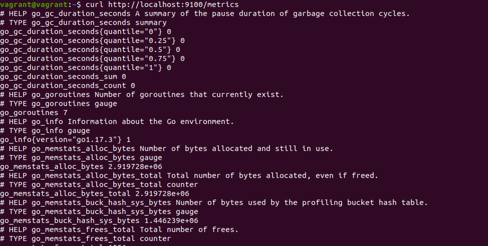
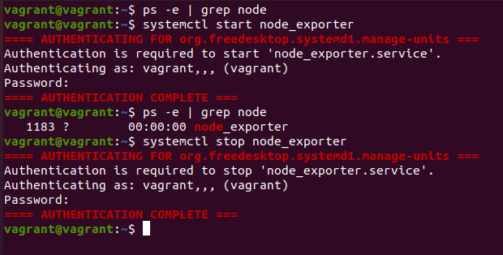
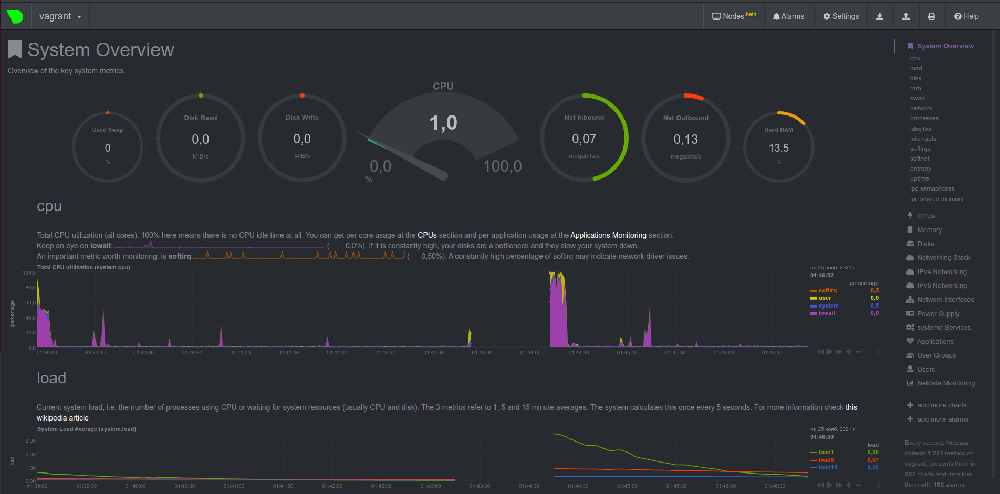
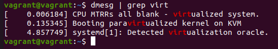

# devops-netology

## Домашнее задание к занятию "3.4. Операционные системы, лекция 2"

1) Успешно установил node_exporter. curl http://localhost:9100/metrics возвращает метрики.



Далее, создал в /etc/systemd/system файл node_exporter.service со следующим содержимым

```text
[Unit]
Description=Node Exporter
 
[Service]
ExecStart=/home/vagrant/node_exporter/node_exporter-1.3.0.linux-amd64/node_exporter
EnvironmentFile=/home/vagrant/node_exporter/node_exporter-1.3.0.linux-amd64/node_exporter_vars
 
[Install]
WantedBy=default.target
```
, где ExecStart - файл запуска, EnvironmentFile соответственно, файл переменных окружения.
После перезагрузки VM процесс успешно запускается и останавливается.



Также, проверка файла environ в директории PID процесса выдает след. результат:
LANG=en_US.UTF-8LANGUAGE=en_US:PATH=/usr/local/sbin:/usr/local/bin:/usr/sbin:/usr/bin:/sbin:/bin:/snap/binINVOCATION_ID=8b27b11b29c8469b889c2da88d4ca28dJOURNAL_STREAM=9:28295**test_var=value**

Переменная была задана в файле node_exporter_vars, что таким образом означает, что переменные окружения передаются корректно.

2) Для CPU это

```text
node_cpu_seconds_total{cpu="0",mode="system"} 4.12
node_cpu_seconds_total{cpu="0",mode="user"} 3.03
process_cpu_seconds_total 0.06
```

Память

```text
node_memory_MemAvailable_bytes 7.69253376e+08
node_memory_MemFree_bytes 6.60451328e+08
node_memory_SwapFree_bytes 1.027600384e+09
```

Диски (для каждого, если их несколько)

```text
node_disk_io_now{device="dm-0"} 0
node_disk_io_time_seconds_total{device="dm-0"} 49.632
node_disk_read_time_seconds_total{device="dm-0"} 321.176
node_disk_read_bytes_total{device="dm-0"} 2.31728128e+08
node_disk_write_time_seconds_total{device="dm-0"} 13.008000000000001
node_disk_write_time_seconds_total{device="dm-0"} 13.008000000000001
node_disk_written_bytes_total{device="dm-0"} 1.4733312e+07
```

Сеть (так же для каждого активного адаптера)
```text
    node_network_receive_errs_total{device="eth0"} 
    node_network_receive_bytes_total{device="eth0"} 
    node_network_transmit_bytes_total{device="eth0"}
    node_network_transmit_errs_total{device="eth0"}
```
3) Установил netdata, добавил в конфиге bind to = 0.0.0.0, пробросил порт 19999 в vagrant до хостовой машины, далее перезапустил виртуальную машину используя vagrant reload. Вывод при переходе на localhost:19999



4) Можно, в выводе присутствует соответствующая строка "CPU MTRRs all blank - virtualized system."



5) fs.nr_open обозначает максимальное количество дескрипторов файлов, которое может выделить процесс. Значение по умолчанию - 1024 * 1024 (1048576). Значение лимита, который не может превысить данный параметр
```text
sysctl fs.file-max
```
и имеет значение 9223372036854775807 и обозначает максимальное количество дескрипторов файлов, которые выделяет ядро Linux.

6) Запустил процесс, определил его PID, после чего в новом терминале смонтировал процесс в отдельный namespace, ps показывает другие процессы.
```text
vagrant@vagrant:~$ sudo -i
root@vagrant:~# sleep 1h
```

В новом терминале

```text
vagrant@vagrant:~$ ps aux | grep sleep
root        1301  0.0  0.0   8076   592 pts/0    S+   19:45   0:00 sleep 1h
vagrant     1355  0.0  0.0   8900   736 pts/1    S+   19:46   0:00 grep --color=auto sleep
vagrant@vagrant:~$ sudo -i
root@vagrant:~# nsenter -t 1301 -p -m
root@vagrant:/# ps
    PID TTY          TIME CMD
   1356 pts/1    00:00:00 sudo
   1358 pts/1    00:00:00 bash
   1367 pts/1    00:00:00 nsenter
   1370 pts/1    00:00:00 bash
   1379 pts/1    00:00:00 ps
```

7) :(){ :|:& };: это так называемая форк-бомба. По сути это рекурсивная функция с именем ":", которая в теле функции вызывает сама себя дважды, после чего, дочерние создают еще 2 новых фоновых процесса и так до бесконечности.
Судя по всему, этот механизм помог в стабилизации:
```text
[ 1104.326466] cgroup: fork rejected by pids controller in /user.slice/user-1000.slice/session-7.scope
```
Установить количество процессов можно, используя ulimit -u (по умолчанию 3571), то есть ulimit -u 3 задает 3 процесса.