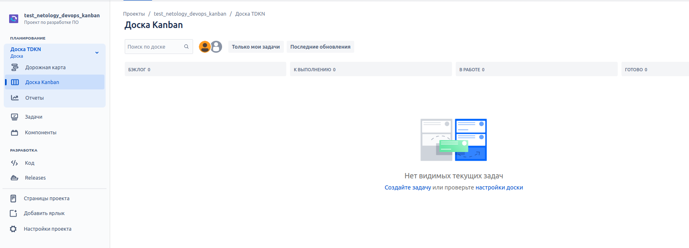
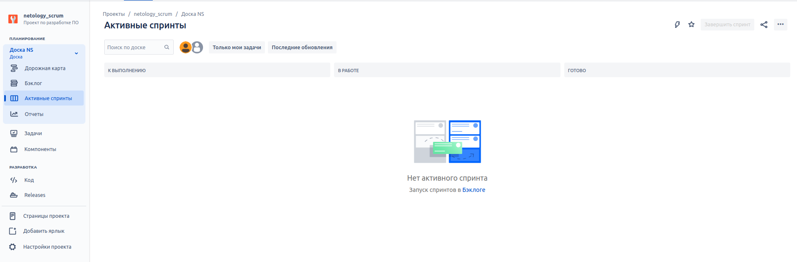
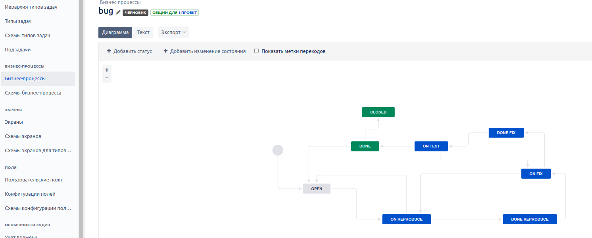
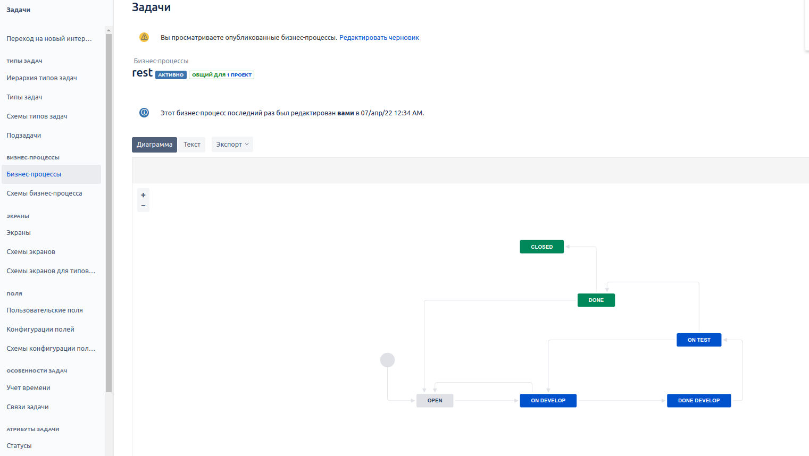
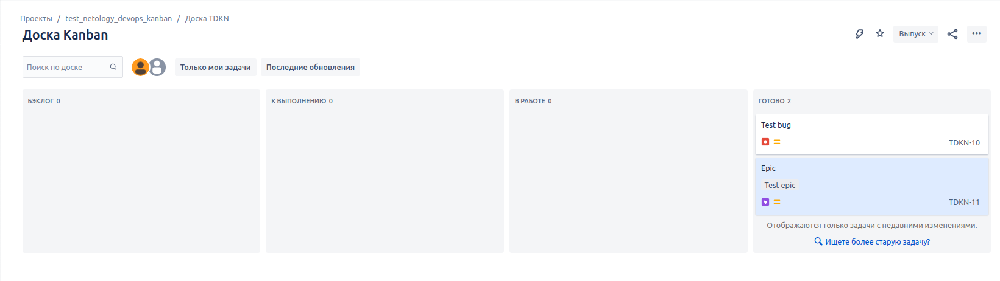
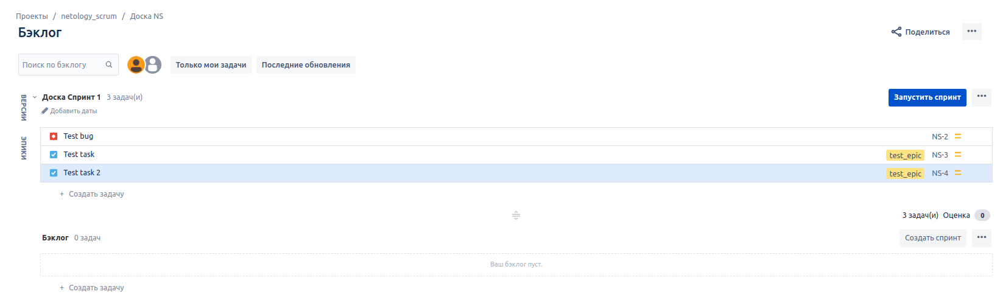
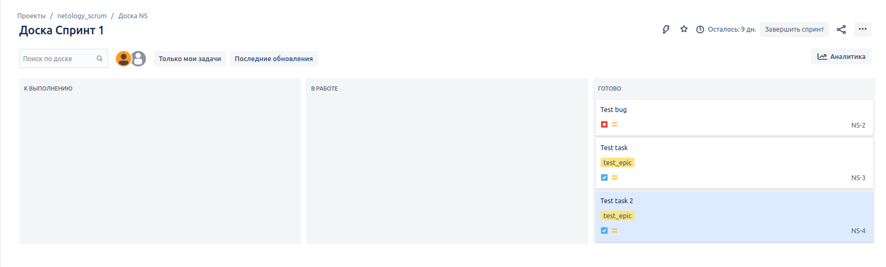

# devops-netology

## Домашнее задание к занятию "09.01 Жизненный цикл ПО"

### Подготовка к выполнению
Выполнено. Получил бесплатную JIRA, зарегистрировавшись на сайте по ссылке.
Создал доски kanban и scrum. 

### Основная часть
Добавил необходимые статусы для бизнес-процессов, далее, создал 2 бизнес-процесса согласно жизненному циклу из задания - для бага и остальных. 

Задал для схем проекта созданные бизнес-процессы и опубликовал их. 
Создал задачи для доски Kanban и прошел их до статуса Done, после чего, переведя их в статус Open. 

Далее, создал задачи с типом Bug и Epic для Scrum-проекта, для последней создав подзадачи и создал спринт, после чего провел задачи до статуса Closed. 

Xml-файлы workflow приложены к решению.