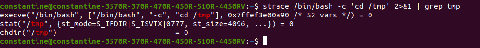

# devops-netology

## Домашнее задание к занятию "3.3. Операционные системы, лекция 1"

1) Результат выполнения команды 

```bash
strace /bin/bash -c 'cd /tmp' 2>&1 | grep /tmp
```
для поиска системного вызова перехода в директорию temp.

В данном случае системный вызов команды cd - chdir("/tmp").

2) Файл базы данных типов типов находится в /usr/share/misc/magic.mgc.
```bash
$ strace file /dev/tty 2>&1 | grep magic
openat(AT_FDCWD, "/lib/x86_64-linux-gnu/libmagic.so.1", O_RDONLY|O_CLOEXEC) = 3
stat("/home/vagrant/.magic.mgc", 0x7ffd07f2c810) = -1 ENOENT (No such file or directory)
stat("/home/vagrant/.magic", 0x7ffd07f2c810) = -1 ENOENT (No such file or directory)
openat(AT_FDCWD, "/etc/magic.mgc", O_RDONLY) = -1 ENOENT (No such file or directory)
stat("/etc/magic", {st_mode=S_IFREG|0644, st_size=111, ...}) = 0
openat(AT_FDCWD, "/etc/magic", O_RDONLY) = 3
openat(AT_FDCWD, "/usr/share/misc/magic.mgc", O_RDONLY) = 3
```
Так же идет обращение к /etc/magic, в который можно сохранять локальные данные для file, судя по описанию внутри файла.

3) Создал текстовый файл, открыл его в vi, но в тоже время удалил как сам файл, так и .swp. Через pstree -p нашел PID процесса, далее проверил какие файлы используются процессом, используя lsof.

```bash
$ lsof -p 32870
vi      32870 constantine    4u   REG    8,2    12288 28973358 /home/constantine/.test.txt.swp (deleted)
```

Файловый дескриптор в данном случае 4. Далее, я использовал следующую команду для обнуления файла.
```bash
$ echo '' > /proc/32870/fd/4
```
4) "Зомби" процессы освобождают свои ресурсы, но не освобождают запись в таблице процессов. Только при вызове wait() родительским процессом запись дочернем процессе освобождается.
5) /usr/sbin/opensnoop-bpfcc без sudo не запускается. Результат выполнения sudo /usr/sbin/opensnoop-bpfcc

PID    COMM               FD ERR PATH
</br>
911    AppProtectionSe     5   0 /usr/local/lib/AppProtection/libAppProtection.so
</br>
1845   dbus-daemon        81   0 /sys/kernel/security/apparmor/.access
</br>
911    AppProtectionSe     5   0 /usr/local/lib/AppProtection/libAppProtection.so
</br>
1845   dbus-daemon        81   0 /sys/kernel/security/apparmor/.access
</br>
1845   dbus-daemon        81   0 /sys/kernel/security/apparmor/.access
</br>
1845   dbus-daemon        81   0 /sys/kernel/security/apparmor/.access
</br>
1845   dbus-daemon        81   0 /sys/kernel/security/apparmor/.access
</br>
911    AppProtectionSe     5   0 /usr/local/lib/AppProtection/libAppProtection.so

6) Системный вызов команды - uname(). Цитата:

***"Part of the utsname information is also accessible  via  /proc/sys/ker-
       nel/{ostype, hostname, osrelease, version, domainname}."***

7) ; - разделитель между командами, которые выполняются одна за другой. && - логический оператор (логическое И), который означает, что операция справа будет выполнена только в случае успешного выполнения операции слева (0). 
set -e - это команда, которая прекращает сессию, если в дальнейшем в конвеере будет вызвана команда, возвращающая ненулевой результат, кроме последней. Использовать set -e скорее всего смысла не имеет, так как при ошибке выполнение команд прекратиться.
Либо пользователь во время сессии должен быть уверен, что все команды выполнятся успешно.

8) set -euxo pipefail
* -e прерывает выполнение сессии при ошибке любой команды кроме последней в последовательности.
* -x вывод трейса команд 
* -u неопределенные или незаданные параметры и/или переменные будут считаться ошибками, с выводом в stderr текста ошибки
* -o pipefail - если установлено, возвращаемое значение конвейера является значением последней (самой правой) команды для выхода с ненулевым статусом или нулем, если все команды в конвейере завершаются успешно.

Это удобно для логирования, а также в том случае, если необходимо завершить последовательность команд (кроме последней), в случае возникновения ошибок во время выполнения.

9) Результат выполнения команды ps -o stat:
* S (S+, Ss, Ssl, Ss+) - спящие процессы (ожидание завершения события)
* I (I, I<) - фоновые (неактивные) процессы ядра
