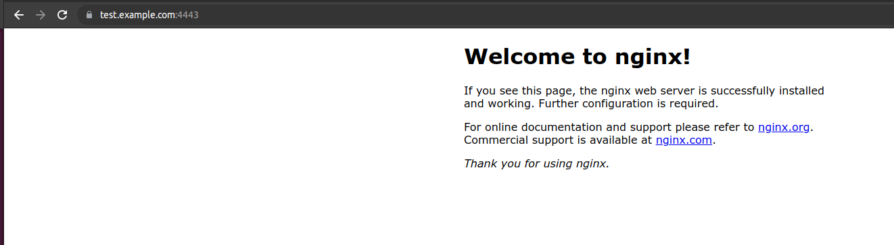
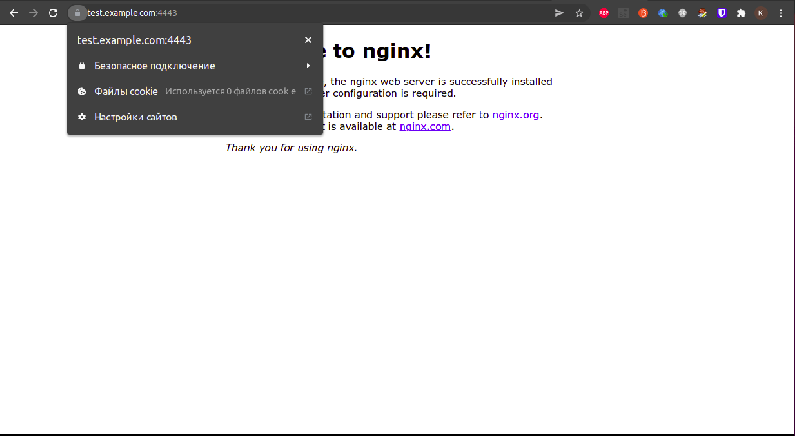
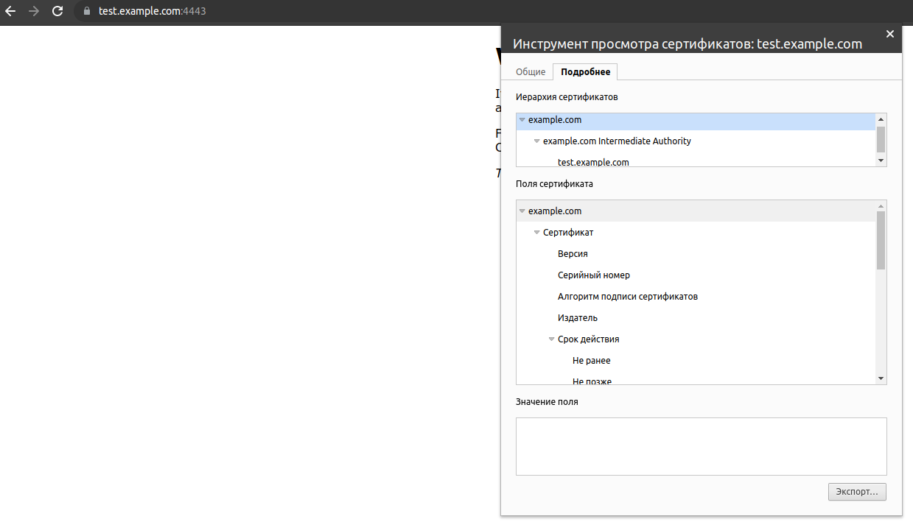
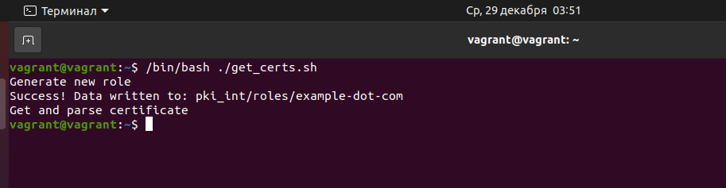
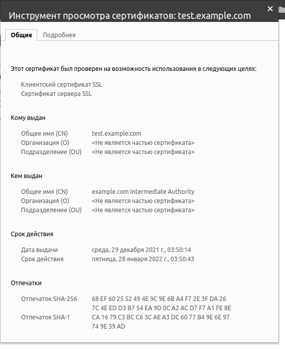

# devops-netology

## Курсовая работа по итогам модуля "DevOps и системное администрирование"

1) Выполнено.
2) Выполнено.

```bash
vagrant@vagrant:~$ sudo apt-get update
Hit:1 http://security.ubuntu.com/ubuntu focal-security InRelease
Hit:2 http://archive.ubuntu.com/ubuntu focal InRelease
Hit:3 http://archive.ubuntu.com/ubuntu focal-updates InRelease
Hit:4 http://archive.ubuntu.com/ubuntu focal-backports InRelease
Reading package lists... Done
vagrant@vagrant:~$ sudo apt-get install -y ufw
Reading package lists... Done
Building dependency tree       
Reading state information... Done
The following packages will be upgraded:
  ufw
1 upgraded, 0 newly installed, 0 to remove and 103 not upgraded.
Need to get 147 kB of archives.
After this operation, 3,072 B of additional disk space will be used.
Get:1 http://archive.ubuntu.com/ubuntu focal-updates/main amd64 ufw all 0.36-6ubuntu1 [147 kB]
Fetched 147 kB in 0s (344 kB/s)
Preconfiguring packages ...
(Reading database ... 54080 files and directories currently installed.)
Preparing to unpack .../ufw_0.36-6ubuntu1_all.deb ...
Unpacking ufw (0.36-6ubuntu1) over (0.36-6) ...
Setting up ufw (0.36-6ubuntu1) ...
Processing triggers for man-db (2.9.1-1) ...
Processing triggers for rsyslog (8.2001.0-1ubuntu1.1) ...
Processing triggers for systemd (245.4-4ubuntu3.11) ...
vagrant@vagrant:~$ sudo ufw default allow outgoing
Default outgoing policy changed to 'allow'
(be sure to update your rules accordingly)
vagrant@vagrant:~$ sudo ufw allow 22
Rules updated
Rules updated (v6)
vagrant@vagrant:~$ sudo ufw allow 443
Rules updated
Rules updated (v6)
vagrant@vagrant:~$ sudo ufw default allow incoming
Default incoming policy changed to 'allow'
(be sure to update your rules accordingly)
```

3) Выполнено

```bash
vagrant@vagrant:~$ curl -fsSL https://apt.releases.hashicorp.com/gpg | sudo apt-key add -
OK
vagrant@vagrant:~$ sudo apt-add-repository "deb [arch=amd64] https://apt.releases.hashicorp.com $(lsb_release -cs) main"
Hit:1 http://archive.ubuntu.com/ubuntu focal InRelease
Hit:2 http://archive.ubuntu.com/ubuntu focal-updates InRelease
Hit:3 http://archive.ubuntu.com/ubuntu focal-backports InRelease                   
Get:4 https://apt.releases.hashicorp.com focal InRelease [9,495 B]                               
Hit:5 http://security.ubuntu.com/ubuntu focal-security InRelease                       
Get:6 https://apt.releases.hashicorp.com focal/main amd64 Packages [41.1 kB]
Fetched 50.6 kB in 1s (51.9 kB/s)  
Reading package lists... Done
vagrant@vagrant:~$ sudo apt-get update && sudo apt-get install vault
Hit:1 http://archive.ubuntu.com/ubuntu focal InRelease
Hit:2 http://archive.ubuntu.com/ubuntu focal-updates InRelease
Hit:3 http://archive.ubuntu.com/ubuntu focal-backports InRelease
Hit:4 http://security.ubuntu.com/ubuntu focal-security InRelease
Hit:5 https://apt.releases.hashicorp.com focal InRelease    
Reading package lists... Done                               
Reading package lists... Done
Building dependency tree       
Reading state information... Done
The following NEW packages will be installed:
  vault
0 upgraded, 1 newly installed, 0 to remove and 103 not upgraded.
Need to get 69.4 MB of archives.
After this operation, 188 MB of additional disk space will be used.
Get:1 https://apt.releases.hashicorp.com focal/main amd64 vault amd64 1.9.2 [69.4 MB]
Fetched 69.4 MB in 11s (6,243 kB/s)                                                                                                          
Selecting previously unselected package vault.
(Reading database ... 54080 files and directories currently installed.)
Preparing to unpack .../archives/vault_1.9.2_amd64.deb ...
Unpacking vault (1.9.2) ...
Setting up vault (1.9.2) ...
Generating Vault TLS key and self-signed certificate...
Generating a RSA private key
..............................................................................................++++
...........................++++
writing new private key to 'tls.key'
-----
Vault TLS key and self-signed certificate have been generated in '/opt/vault/tls'.
```

4) Выполнено.

В отдельном терминале выполнить 

```bash
vault server -dev -dev-root-token-id root
```

Далее

```bash
vagrant@vagrant:~$ export VAULT_ADDR=http://127.0.0.1:8200
vagrant@vagrant:~$ export VAULT_TOKEN=root
vagrant@vagrant:~$ vault secrets enable pki
Success! Enabled the pki secrets engine at: pki/
vagrant@vagrant:~$ vault secrets tune -max-lease-ttl=87600h pki
Success! Tuned the secrets engine at: pki/
vagrant@vagrant:~$ vault write -field=certificate pki/root/generate/internal \
>      common_name="example.com" \
>      ttl=87600h > CA_cert.crt
vagrant@vagrant:~$ ls -l
total 24
-rw------- 1 vagrant vagrant 1095 Dec 16 20:31 authorized_keys
-rw-rw-r-- 1 vagrant vagrant 1171 Dec 27 19:18 CA_cert.crt
-rw-rw-r-- 1 vagrant vagrant 6176 Dec 21 21:06 curl.log
-rw-rw-r-- 1 vagrant vagrant  266 Dec 21 20:40 ping.log
drwxrwxr-x 9 vagrant vagrant 4096 Dec 16 19:23 testssl.sh
vagrant@vagrant:~$ vault write pki/config/urls \
>      issuing_certificates="$VAULT_ADDR/v1/pki/ca" \
>      crl_distribution_points="$VAULT_ADDR/v1/pki/crl"
Success! Data written to: pki/config/urls
vagrant@vagrant:~$ vault secrets enable -path=pki_int pki
Success! Enabled the pki secrets engine at: pki_int/
vagrant@vagrant:~$ vault secrets tune -max-lease-ttl=43800h pki_int
Success! Tuned the secrets engine at: pki_int/
vagrant@vagrant:~$ vault write -format=json pki_int/intermediate/generate/internal \
>      common_name="example.com Intermediate Authority" \
>      | jq -r '.data.csr' > pki_intermediate.csr
vagrant@vagrant:~$ vault write -format=json pki/root/sign-intermediate csr=@pki_intermediate.csr \
>      format=pem_bundle ttl="43800h" \
>      | jq -r '.data.certificate' > intermediate.cert.pem
vagrant@vagrant:~$ vault write pki_int/intermediate/set-signed certificate=@intermediate.cert.pem
Success! Data written to: pki_int/intermediate/set-signed
vagrant@vagrant:~$ vault write pki_int/roles/example-dot-com \
>      allowed_domains="example.com" \
>      allow_subdomains=true \
>      max_ttl="1440h"
Success! Data written to: pki_int/roles/example-dot-com
vagrant@vagrant:~$ vault write pki_int/issue/example-dot-com common_name="test.example.com" ttl="720h"
```

Далее, сохраняем полученную информацию о цепочке сертификатов и private key в соответствующие файлы 
(certificate и issuing_ca в /certs/test-example.crt, private_key в /certs/test-example.key).

```bash
vagrant@vagrant:~$ mkdir certs
vagrant@vagrant:~$ cd certs
vagrant@vagrant:~$ sudo nano test-example.key
vagrant@vagrant:~$ sudo nano test-example.crt
```

5) Выполнено. Копируем содержимое корневого сертификата (CA_cert.crt) на хостовую машину. Далее 

```bash
constantine@constantine~$ sudo cp CA_cert.crt /usr/local/share/ca-certificates/
constantine@constantine~$ sudo update-ca-certificates
Updating certificates in /etc/ssl/certs...
1 added, 0 removed; done.
Running hooks in /etc/ca-certificates/update.d...
done.
constantine@constantine~$ awk -v cmd='openssl x509 -noout -subject' ' /BEGIN/{close(cmd)};{print | cmd}' < /etc/ssl/certs/ca-certificates.crt | grep -i example
subject=CN = example.com
```

6) Выполнено.

```bash
vagrant@vagrant:~$ sudo apt update
Hit:1 http://security.ubuntu.com/ubuntu focal-security InRelease
Hit:2 http://archive.ubuntu.com/ubuntu focal InRelease     
Hit:3 http://archive.ubuntu.com/ubuntu focal-updates InRelease     
Hit:4 http://archive.ubuntu.com/ubuntu focal-backports InRelease                   
Hit:5 https://apt.releases.hashicorp.com focal InRelease                          
Reading package lists... Done                               
Building dependency tree       
Reading state information... Done
103 packages can be upgraded. Run 'apt list --upgradable' to see them.
vagrant@vagrant:~$ sudo apt install nginx
vagrant@vagrant:~$ systemctl status nginx
  nginx.service - A high performance web server and a reverse proxy server
     Loaded: loaded (/lib/systemd/system/nginx.service; enabled; vendor preset: enabled)
     Active: inactive (dead)
       Docs: man:nginx(8)
```


7) Выполнено. Перейдем в папку с включенными сайтами и добавим конфигурацию для тестового сайта.

```bash
vagrant@vagrant: cd /etc/nginx/sites-enabled
vagrant@vagrant:/etc/nginx/sites-enabled$ sudo nano test-example
```

Сама конфигурация выглядит следующим образом: 

```text
server {
        # SSL configuration
        #
        listen 443 ssl;
        listen [::]:443 ssl;
        
	ssl_certificate     /home/vagrant/test-example.crt;
    	ssl_certificate_key /home/vagrant/test-example.key;
    	ssl_protocols       TLSv1 TLSv1.1 TLSv1.2;
    	ssl_ciphers         HIGH:!aNULL:!MD5;

        root /var/www/html;

        index index.html index.htm index.nginx-debian.html;

        server_name www.example.com;

        location / {
                try_files $uri $uri/ =404;
        }

}
```

Далее 

```bash
vagrant@vagrant:/etc/nginx/sites-enabled$ sudo service nginx restart
```

8) Выполнено.







9) Выполнено. Скрипт для обновления сертификатов

```bash                                                             
#!/bin/bash
echo "Generate new role"

echo $(vault write pki_int/roles/example-dot-com \
     allowed_domains="example.com" \
     allow_subdomains=true \
     max_ttl="1440h")

echo "Get and parse certificate"

data=$(vault write --format=json pki_int/issue/example-dot-com common_name="test.example.com" ttl="720h")


echo "$data" | jq -r .data.certificate > /home/vagrant/test-example.pem
echo "$data"| jq -r .data.issuing_ca >> /home/vagrant/test-example.pem
echo "$data" | jq -r .data.private_key > /home/vagrant/test-example.key

sudo service nginx restart
```

В результате выполнения скрипта сертификаты были успешно обновлены.





10) Выполнено. Добавляем новое задание в crontab (crontab -e), для примера, выполнение каждые 2 минуты

```text
0/2 * * * * /home/vagrant/get_certs.sh
```

После отработки заданий, смотрим syslog

```bash
vagrant@vagrant:~$ cat /var/log/syslog | grep CRON
Dec 28 18:28:39 vagrant cron[643]: (CRON) INFO (pidfile fd = 3)
Dec 28 18:28:39 vagrant cron[643]: (CRON) INFO (Running @reboot jobs)
Dec 28 19:17:01 vagrant CRON[67359]: (root) CMD (   cd / && run-parts --report /etc/cron.hourly)
Dec 28 20:17:01 vagrant CRON[67702]: (root) CMD (   cd / && run-parts --report /etc/cron.hourly)
Dec 28 21:17:01 vagrant CRON[67789]: (root) CMD (   cd / && run-parts --report /etc/cron.hourly)
Dec 28 22:17:01 vagrant CRON[67942]: (root) CMD (   cd / && run-parts --report /etc/cron.hourly)
Dec 28 23:02:01 vagrant CRON[68481]: (vagrant) CMD (/home/vagrant/get_certs.sh)
Dec 28 23:02:02 vagrant CRON[68479]: (CRON) info (No MTA installed, discarding output)
Dec 28 23:10:01 vagrant CRON[68541]: (vagrant) CMD (/home/vagrant/get_certs.sh)
Dec 28 23:10:01 vagrant CRON[68540]: (CRON) info (No MTA installed, discarding output)
Dec 28 23:12:01 vagrant CRON[68564]: (vagrant) CMD (/home/vagrant/get_certs.sh)
Dec 28 23:12:01 vagrant CRON[68563]: (CRON) info (No MTA installed, discarding output)
Dec 28 23:14:01 vagrant CRON[68587]: (vagrant) CMD (/home/vagrant/get_certs.sh)
Dec 28 23:14:02 vagrant CRON[68586]: (CRON) info (No MTA installed, discarding output)
```

Как видно, задания успешно выполнялись каждые 2 минуты. Для выполнения задания каждые месяц можно использовать крон, к примеру 0 0 1 * *.