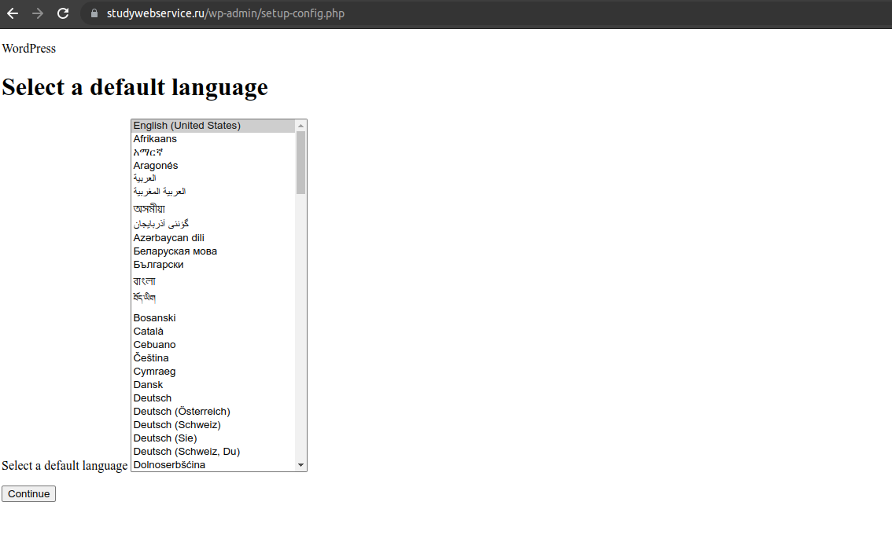
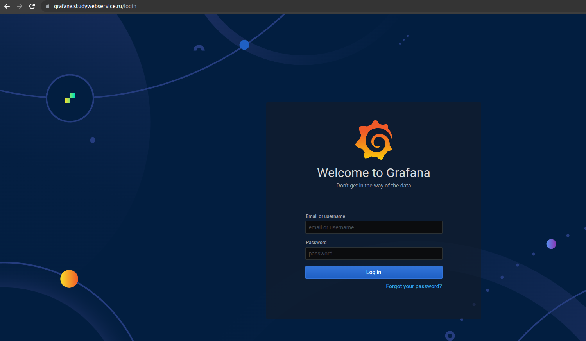
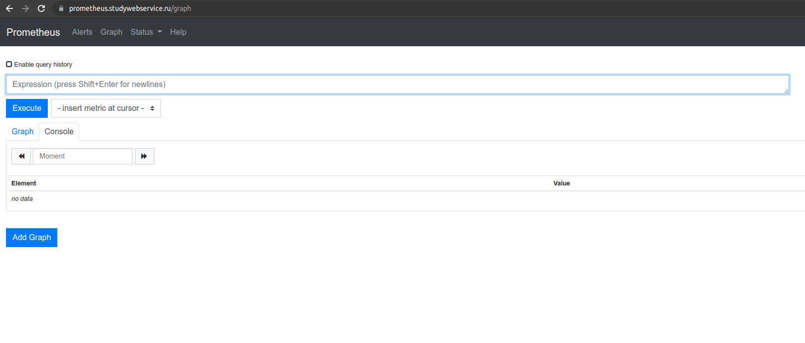

# devops-netology

## Дипломное задание по курсу «DevOps-инженер»

1. Регистрация доменного имени.
<br/>
Выполнено. Зарегистрирован домен на reg.ru studywebservice.ru. Имеется доступ к личному кабинету, а также возможность управлять доменом.

2. Создание инфраструктуры.
<br/>
Создан сервисный аккаунт service-user. Подготовлен Backend для Terraform (использовал вариант S3 bucket в созданном YC аккаунте). Создал 2 воркспейса - stage и prod.

```commandline
constantine@constantine:~/netology devops/Diploma/files/terraform$ terraform init -backend-config=backend.conf

Initializing the backend...

Successfully configured the backend "s3"! Terraform will automatically
use this backend unless the backend configuration changes.

Initializing provider plugins...
- Finding latest version of yandex-cloud/yandex...
- Installing yandex-cloud/yandex v0.76.0...
- Installed yandex-cloud/yandex v0.76.0 (self-signed, key ID E40F590B50BB8E40)

Partner and community providers are signed by their developers.
If you'd like to know more about provider signing, you can read about it here:
https://www.terraform.io/docs/cli/plugins/signing.html

Terraform has created a lock file .terraform.lock.hcl to record the provider
selections it made above. Include this file in your version control repository
so that Terraform can guarantee to make the same selections by default when
you run "terraform init" in the future.

Terraform has been successfully initialized!

You may now begin working with Terraform. Try running "terraform plan" to see
any changes that are required for your infrastructure. All Terraform commands
should now work.

If you ever set or change modules or backend configuration for Terraform,
rerun this command to reinitialize your working directory. If you forget, other
commands will detect it and remind you to do so if necessary.
constantine@constantine:~/netology devops/Diploma/files/terraform$ terraform workspace new stage
Created and switched to workspace "stage"!

You're now on a new, empty workspace. Workspaces isolate their state,
so if you run "terraform plan" Terraform will not see any existing state
for this configuration.
constantine@constantine:~/netology devops/Diploma/files/terraform$ terraform workspace new prod
Created and switched to workspace "prod"!

You're now on a new, empty workspace. Workspaces isolate their state,
so if you run "terraform plan" Terraform will not see any existing state
for this configuration.

```
После чего создал VPC в файле network.tf и добавил две подсети для зон ru-central1-a и ru-central1-b. Terraform plan и terraform destroy выполняются без ошибок.

```
constantine@constantine-3570R-370R-470R-450R-510R-4450RV:~/netology devops/Diploma/files/terraform$ terraform apply
Terraform used the selected providers to generate the following execution plan. Resource actions are indicated with the following symbols:
  + create

Terraform will perform the following actions:

  # yandex_compute_instance.vm-1[0] will be created
  + resource "yandex_compute_instance" "vm-1" {
      + created_at                = (known after apply)
      + folder_id                 = (known after apply)
      + fqdn                      = (known after apply)
      + hostname                  = "vm-1.netology.cloud"
      + id                        = (known after apply)
      + metadata                  = {
          + "ssh-keys" = <<-EOT EOT
        }
      + name                      = "vm-1"
      + network_acceleration_type = "standard"
      + platform_id               = "standard-v1"
      + service_account_id        = (known after apply)
      + status                    = (known after apply)
      + zone                      = "ru-central1-a"

      + boot_disk {
          + auto_delete = true
          + device_name = (known after apply)
          + disk_id     = (known after apply)
          + mode        = (known after apply)

          + initialize_params {
              + block_size  = (known after apply)
              + description = (known after apply)
              + image_id    = "fd8qs44945ddtla09hnr"
              + name        = "root-node01"
              + size        = 10
              + snapshot_id = (known after apply)
              + type        = "network-nvme"
            }
        }

      + network_interface {
          + index              = (known after apply)
          + ip_address         = (known after apply)
          + ipv4               = true
          + ipv6               = (known after apply)
          + ipv6_address       = (known after apply)
          + mac_address        = (known after apply)
          + nat                = true
          + nat_ip_address     = (known after apply)
          + nat_ip_version     = (known after apply)
          + security_group_ids = (known after apply)
          + subnet_id          = (known after apply)
        }

      + placement_policy {
          + host_affinity_rules = (known after apply)
          + placement_group_id  = (known after apply)
        }

      + resources {
          + core_fraction = 100
          + cores         = 2
          + memory        = 2
        }

      + scheduling_policy {
          + preemptible = (known after apply)
        }
    }

  # yandex_vpc_subnet.subnet_a will be created
  + resource "yandex_vpc_subnet" "subnet_a" {
      + created_at     = (known after apply)
      + folder_id      = (known after apply)
      + id             = (known after apply)
      + labels         = (known after apply)
      + name           = "subnet_a"
      + network_id     = "enpku31oeiilja1vc19s"
      + v4_cidr_blocks = [
          + "192.168.101.0/24",
        ]
      + v6_cidr_blocks = (known after apply)
      + zone           = "ru-central1-a"
    }

  # yandex_vpc_subnet.subnet_a will be created
  + resource "yandex_vpc_subnet" "subnet_b" {
      + created_at     = (known after apply)
      + folder_id      = (known after apply)
      + id             = (known after apply)
      + labels         = (known after apply)
      + name           = "subnet_b"
      + network_id     = "enpku31oeiilja1vc19s"
      + v4_cidr_blocks = [
          + "192.168.54.0/24",
        ]
      + v6_cidr_blocks = (known after apply)
      + zone           = "ru-central1-b"
    }

Plan: 3 to add, 0 to change, 1 to destroy.

Changes to Outputs:
  + external_ip_address_vm1_yandex_cloud = [
      + (known after apply),
    ]
  + internal_ip_address_vm1_yandex_cloud = [
      + (known after apply),
    ]

Do you want to perform these actions in workspace "stage"?
  Terraform will perform the actions described above.
  Only 'yes' will be accepted to approve.

  Enter a value: yes

yandex_vpc_subnet.subnet_b: Destroying... [id=e2lp23v0rrgkkepaih07]
yandex_vpc_subnet.subnet_a: Creating...
yandex_vpc_subnet.subnet_a: Creation complete after 10s [id=e9bqpke3q0i13dfvlna5]
yandex_vpc_subnet.subnet_b: Still destroying... [id=e2lp23v0rrgkkepaih07, 10s elapsed]
yandex_vpc_subnet.subnet_b: Destruction complete after 12s
yandex_vpc_subnet.subnet_b: Creating...
yandex_vpc_subnet.subnet_b: Creation complete after 1s [id=e2l2ua1fmrdbgc06em8f]
yandex_compute_instance.vm-1[0]: Creating...
yandex_compute_instance.vm-1[0]: Still creating... [10s elapsed]
yandex_compute_instance.vm-1[0]: Still creating... [20s elapsed]
yandex_compute_instance.vm-1[0]: Still creating... [30s elapsed]
yandex_compute_instance.vm-1[0]: Creation complete after 35s [id=fhm95ffdrcs6ltt246hp]

Apply complete! Resources: 3 added, 0 changed, 1 destroyed.

Outputs:

external_ip_address_vm1_yandex_cloud = [
  "62.84.114.132",
]
internal_ip_address_vm1_yandex_cloud = [
  "192.168.101.16",
]

```
```
yandex_vpc_network.default: Refreshing state... [id=enpku31oeiilja1vc19s]
yandex_vpc_subnet.subnet_a: Refreshing state... [id=e9bqpke3q0i13dfvlna5]
yandex_vpc_subnet.subnet_b: Refreshing state... [id=e2l2ua1fmrdbgc06em8f]
yandex_compute_instance.vm-1[0]: Refreshing state... [id=fhm95ffdrcs6ltt246hp]

Note: Objects have changed outside of Terraform

Terraform detected the following changes made outside of Terraform since the last "terraform apply":

  # yandex_compute_instance.vm-1[0] has been changed
  ~ resource "yandex_compute_instance" "vm-1" {
        id                        = "fhm95ffdrcs6ltt246hp"
      + labels                    = {}
        name                      = "vm-1"
        # (9 unchanged attributes hidden)


        # (5 unchanged blocks hidden)
    }
  # yandex_vpc_network.default has been changed
  ~ resource "yandex_vpc_network" "default" {
        id         = "enpku31oeiilja1vc19s"
        name       = "net"
      ~ subnet_ids = [
          - "e2lp23v0rrgkkepaih07",
          + "e2l2ua1fmrdbgc06em8f",
          + "e9bqpke3q0i13dfvlna5",
        ]
        # (3 unchanged attributes hidden)
    }

Unless you have made equivalent changes to your configuration, or ignored the relevant attributes using ignore_changes, the following plan
may include actions to undo or respond to these changes.

─────────────────────────────────────────────────────────────────────────────────────────────────────────────────────────────────────────────

Terraform used the selected providers to generate the following execution plan. Resource actions are indicated with the following symbols:
  - destroy

Terraform will perform the following actions:

  # yandex_compute_instance.vm-1[0] will be destroyed
  - resource "yandex_compute_instance" "vm-1" {
      - created_at                = "2022-07-14T12:26:40Z" -> null
      - folder_id                 = "b1guh47h7vq31u9t0h9q" -> null
      - fqdn                      = "vm-1.netology.cloud" -> null
      - hostname                  = "vm-1" -> null
      - id                        = "fhm95ffdrcs6ltt246hp" -> null
      - labels                    = {} -> null
      - metadata                  = {
          - "ssh-keys" = <<-EOT
                ubuntu:ssh-rsa AAAAB3NzaC1yc2EAAAADAQABAAABgQC+fpRY7sUVgf07+uVFloFB4ky2cBnfVD0EPaVfHKlTkw35glr6487y5neJPySAJCZxk0WtFOBOQiMQ8ro5lfaCH75RzkBtuMIEh/Ol+p2fiFYUh8p2gGFU1TcYDOj1EBPqeBisBuATrohlFN2J0E2ujXRKOKcTdgE7mfN5d3srvMsVUENQQzkcv2+vxU6IMVe7HJ3tdjBYgZ+PW39AJ0xcmVLDnqxQsaZaxeiyOwp7DWe7tpb4nCfRpkaVNE2+2yiKBgD7tUUrwpmoJHD/HaRQt6x9/qYIR96WihN+Jv7vy66HCo6Ey7Jvq9OxPhdxjFlqNzYP1XLHyDTiuMkbKHztIWhalHxEUwCJuRipVKzCPsSfjw8mmKa8eTpCQGLbULiDKI5gVZ4fyDUk4vHtjxTkzr1xc7e7wBEiV9mkORs1ethM5sRU2twwplbdPs9Vj3uypfmM3d3bVhcBoht4W18pkSuOnaGqzm4pMszdRBDhqjvuEaVlRBj84GEMa+D2/o0= constantine@constantine-3570R-370R-470R-450R-510R-4450RV
            EOT
        } -> null
      - name                      = "vm-1" -> null
      - network_acceleration_type = "standard" -> null
      - platform_id               = "standard-v1" -> null
      - status                    = "running" -> null
      - zone                      = "ru-central1-a" -> null

      - boot_disk {
          - auto_delete = true -> null
          - device_name = "fhm7kpu1s14fasaodu5v" -> null
          - disk_id     = "fhm7kpu1s14fasaodu5v" -> null
          - mode        = "READ_WRITE" -> null

          - initialize_params {
              - block_size = 4096 -> null
              - image_id   = "fd8qs44945ddtla09hnr" -> null
              - name       = "root-node01" -> null
              - size       = 10 -> null
              - type       = "network-ssd" -> null
            }
        }

      - network_interface {
          - index              = 0 -> null
          - ip_address         = "192.168.101.16" -> null
          - ipv4               = true -> null
          - ipv6               = false -> null
          - mac_address        = "d0:0d:92:bd:ed:db" -> null
          - nat                = true -> null
          - nat_ip_address     = "62.84.114.132" -> null
          - nat_ip_version     = "IPV4" -> null
          - security_group_ids = [] -> null
          - subnet_id          = "e9bqpke3q0i13dfvlna5" -> null
        }

      - placement_policy {
          - host_affinity_rules = [] -> null
        }

      - resources {
          - core_fraction = 100 -> null
          - cores         = 2 -> null
          - gpus          = 0 -> null
          - memory        = 2 -> null
        }

      - scheduling_policy {
          - preemptible = false -> null
        }
    }

  # yandex_vpc_network.default will be destroyed
  - resource "yandex_vpc_network" "default" {
      - created_at = "2022-07-14T12:22:57Z" -> null
      - folder_id  = "b1guh47h7vq31u9t0h9q" -> null
      - id         = "enpku31oeiilja1vc19s" -> null
      - labels     = {} -> null
      - name       = "net" -> null
      - subnet_ids = [
          - "e2l2ua1fmrdbgc06em8f",
          - "e9bqpke3q0i13dfvlna5",
        ] -> null
    }

  # yandex_vpc_subnet.subnet_a will be destroyed
  - resource "yandex_vpc_subnet" "subnet_a" {
      - created_at     = "2022-07-14T12:26:34Z" -> null
      - folder_id      = "b1guh47h7vq31u9t0h9q" -> null
      - id             = "e9bqpke3q0i13dfvlna5" -> null
      - labels         = {} -> null
      - name           = "subnet_a" -> null
      - network_id     = "enpku31oeiilja1vc19s" -> null
      - v4_cidr_blocks = [
          - "192.168.101.0/24",
        ] -> null
      - v6_cidr_blocks = [] -> null
      - zone           = "ru-central1-a" -> null
    }

  # yandex_vpc_subnet.subnet_b will be destroyed
  - resource "yandex_vpc_subnet" "subnet_b" {
      - created_at     = "2022-07-14T12:26:37Z" -> null
      - folder_id      = "b1guh47h7vq31u9t0h9q" -> null
      - id             = "e2l2ua1fmrdbgc06em8f" -> null
      - labels         = {} -> null
      - name           = "subnet_b" -> null
      - network_id     = "enpku31oeiilja1vc19s" -> null
      - v4_cidr_blocks = [
          - "192.168.54.0/24",
        ] -> null
      - v6_cidr_blocks = [] -> null
      - zone           = "ru-central1-b" -> null
    }

Plan: 0 to add, 0 to change, 4 to destroy.

Changes to Outputs:
  - external_ip_address_vm1_yandex_cloud = [
      - "62.84.114.132",
    ] -> null
  - internal_ip_address_vm1_yandex_cloud = [
      - "192.168.101.16",
    ] -> null

Do you really want to destroy all resources in workspace "stage"?
  Terraform will destroy all your managed infrastructure, as shown above.
  There is no undo. Only 'yes' will be accepted to confirm.

  Enter a value: yes

yandex_compute_instance.vm-1[0]: Destroying... [id=fhm95ffdrcs6ltt246hp]
yandex_compute_instance.vm-1[0]: Still destroying... [id=fhm95ffdrcs6ltt246hp, 10s elapsed]
yandex_compute_instance.vm-1[0]: Destruction complete after 18s
yandex_vpc_subnet.subnet_b: Destroying... [id=e2l2ua1fmrdbgc06em8f]
yandex_vpc_subnet.subnet_a: Destroying... [id=e9bqpke3q0i13dfvlna5]
yandex_vpc_subnet.subnet_b: Destruction complete after 6s
yandex_vpc_subnet.subnet_a: Destruction complete after 7s
yandex_vpc_network.default: Destroying... [id=enpku31oeiilja1vc19s]
yandex_vpc_network.default: Destruction complete after 1s

Destroy complete! Resources: 4 destroyed.

```

3. Установка Nginx и LetsEncrypt
Создал отдельную виртуальную машину, а также playbook и ansible-роль для установки nginx, certbot и python3-certbot-nginx, а также добавления специально подготовленного www.studywebservice.ru.conf файла для nginx. 
Создал предварительно файл inventory.tf для автоматической генерации inventory для playbook. После отработки playbook 
запустил генерацию сертификатов для DNS-записей используя команду 
`sudo certbot --nginx --test-cert -d studywebservice.ru -d www.studywebservice.ru -d alertmanager.studywebservice.ru -d gitlab.studywebservice.ru -d grafana.studywebservice.ru -d prometheus.studywebservice.ru`.
После этого, добавил upstream и настройки обратного прокси для каждого DNS. Окончательный вариант конфига

```commandline
upstream studywebservice {
    server studywebservice.ru;
    server www.studywebservice.ru;
}

server {
    root /var/www/html;
    server_name studywebservice.ru www.studywebservice.ru;
    access_log   /var/log/nginx/access.log;

    listen 443 ssl; # managed by Certbot
    ssl_certificate /etc/letsencrypt/live/studywebservice.ru/fullchain.pem; # managed by Certbot
    ssl_certificate_key /etc/letsencrypt/live/studywebservice.ru/privkey.pem; # managed by Certbot
    include /etc/letsencrypt/options-ssl-nginx.conf; # managed by Certbot
    ssl_dhparam /etc/letsencrypt/ssl-dhparams.pem; # managed by Certbot

    location / {

      proxy_set_header        Host $host;
      proxy_set_header        X-Real-IP $remote_addr;
      proxy_set_header        X-Forwarded-For $proxy_add_x_forwarded_for;
      proxy_set_header        X-Forwarded-Proto $scheme;

      proxy_pass          https://studywebservice;
      proxy_read_timeout  90;

      proxy_redirect      https://studywebservice.ru https://google.com;
      proxy_redirect      https://www.studywebservice.ru https://google.com;
    }

}

upstream alertmanager_studywebservice {
    server alertmanager.studywebservice.ru;
}


server {
    root /var/www/html;
    server_name alertmanager.studywebservice.ru;
    access_log   /var/log/nginx/access.log;

    listen 443 ssl; # managed by Certbot
    ssl_certificate /etc/letsencrypt/live/studywebservice.ru/fullchain.pem; # managed by Certbot
    ssl_certificate_key /etc/letsencrypt/live/studywebservice.ru/privkey.pem; # managed by Certbot
    include /etc/letsencrypt/options-ssl-nginx.conf; # managed by Certbot
    ssl_dhparam /etc/letsencrypt/ssl-dhparams.pem; # managed by Certbot

    location / {

      proxy_set_header        Host $host;
      proxy_set_header        X-Real-IP $remote_addr;
      proxy_set_header        X-Forwarded-For $proxy_add_x_forwarded_for;
      proxy_set_header        X-Forwarded-Proto $scheme;

      proxy_pass          https://alertmanager_studywebservice;
      proxy_read_timeout  90;

      proxy_redirect      https://alertmanager.studywebservice.ru https://yandex.com;
    }

}

upstream gitlab_studywebservice {
    server gitlab.studywebservice.ru;
}

server {
    root /var/www/html;
    server_name gitlab.studywebservice.ru;


    listen 443 ssl; # managed by Certbot
    ssl_certificate /etc/letsencrypt/live/studywebservice.ru/fullchain.pem; # managed by Certbot
    ssl_certificate_key /etc/letsencrypt/live/studywebservice.ru/privkey.pem; # managed by Certbot
    include /etc/letsencrypt/options-ssl-nginx.conf; # managed by Certbot
    ssl_dhparam /etc/letsencrypt/ssl-dhparams.pem; # managed by Certbot

    location / {

      proxy_set_header        Host $host;
      proxy_set_header        X-Real-IP $remote_addr;
      proxy_set_header        X-Forwarded-For $proxy_add_x_forwarded_for;
      proxy_set_header        X-Forwarded-Proto $scheme;

      proxy_pass          https://gitlab_studywebservice;
      proxy_read_timeout  90;

      proxy_redirect      https://gitlab.studywebservice.ru https://yandex.com;
    }

}

upstream grafana_studywebservice {
    server grafana.studywebservice.ru;
}

server {
    root /var/www/html;
    server_name grafana.studywebservice.ru;


    listen 443 ssl; # managed by Certbot
    ssl_certificate /etc/letsencrypt/live/studywebservice.ru/fullchain.pem; # managed by Certbot
    ssl_certificate_key /etc/letsencrypt/live/studywebservice.ru/privkey.pem; # managed by Certbot
    include /etc/letsencrypt/options-ssl-nginx.conf; # managed by Certbot
    ssl_dhparam /etc/letsencrypt/ssl-dhparams.pem; # managed by Certbot

    location / {

      proxy_set_header        Host $host;
      proxy_set_header        X-Real-IP $remote_addr;
      proxy_set_header        X-Forwarded-For $proxy_add_x_forwarded_for;
      proxy_set_header        X-Forwarded-Proto $scheme;

      proxy_pass          https://grafana_studywebservice;
      proxy_read_timeout  90;

      proxy_redirect      https://grafana.studywebservice.ru https://yandex.com;
    }


}

upstream prometheus_studywebservice {
    server prometheus.studywebservice.ru;
}

server {
    root /var/www/html;
    server_name prometheus.studywebservice.ru;


    listen 443 ssl; # managed by Certbot
    ssl_certificate /etc/letsencrypt/live/studywebservice.ru/fullchain.pem; # managed by Certbot
    ssl_certificate_key /etc/letsencrypt/live/studywebservice.ru/privkey.pem; # managed by Certbot
    include /etc/letsencrypt/options-ssl-nginx.conf; # managed by Certbot
    ssl_dhparam /etc/letsencrypt/ssl-dhparams.pem; # managed by Certbot

    location / {

      proxy_set_header        Host $host;
      proxy_set_header        X-Real-IP $remote_addr;
      proxy_set_header        X-Forwarded-For $proxy_add_x_forwarded_for;
      proxy_set_header        X-Forwarded-Proto $scheme;

      proxy_pass          https://prometheus_studywebservice;
      proxy_read_timeout  90;

      proxy_redirect      https://prometheus.studywebservice.ru https://yandex.com;
    }

}

server {
    if ($host = www.studywebservice.ru) {
        return 301 https://$host$request_uri;
    } # managed by Certbot


    if ($host = studywebservice.ru) {
        return 301 https://$host$request_uri;
    } # managed by Certbot


    server_name studywebservice.ru www.studywebservice.ru;
    listen 80;
    return 404; # managed by Certbot


}

server {
    if ($host = alertmanager.studywebservice.ru) {
        return 301 https://$host$request_uri;
    } # managed by Certbot


    server_name alertmanager.studywebservice.ru;
    listen 80;
    return 404; # managed by Certbot


}

server {
    if ($host = gitlab.studywebservice.ru) {
        return 301 https://$host$request_uri;
    } # managed by Certbot


    server_name gitlab.studywebservice.ru;
    listen 80;
    return 404; # managed by Certbot


}

server {
    if ($host = grafana.studywebservice.ru) {
        return 301 https://$host$request_uri;
    } # managed by Certbot


    server_name grafana.studywebservice.ru;
    listen 80;
    return 404; # managed by Certbot


}

server {
    if ($host = prometheus.studywebservice.ru) {
        return 301 https://$host$request_uri;
    } # managed by Certbot


    server_name prometheus.studywebservice.ru;
    listen 80;
    return 404; # managed by Certbot


}
```
После перезапуска nginx при открытии в браузуре любой DNS-записи отображается 502 ошибка


4. Установка кластера MySQL

Создал ресурс из 2 ВМ для master и clave реплик для кластера MySQL, используя terraform, а также отдельный ресурс 
local_file для создания mysql_vars.tf, в который автоматически помещается адрес мастера, 
после чего создал 3 ansible-роли - первая для общей установке MySQL на ВМ (включая создание пользователя wordpress), 
остальные для конфигурирования мастера (включая создание БД wordpress) и слейва. В первой мы создаем БД wordpress, REPLICATION SLAVE пользователя и 
копируем подготовленный mysqld.cnf. Во второй мы также копируем mysqld.cnf плюс конфигурируем репликацию, указывая 
основные параметры для нее. `Вывод команды show slave status;`


Как видно, подключение со слейв-машины на мастер прошло успешно. Также репликация была успешно протестирована на примере
создания таблиц и баз данных на мастере и автоматический перенос их на слейв.


5. Установка WordPress
Выполнено. Создана ВМ для Wordpress и Apache2. В terraform добавлено создание ресурса local_file wordpress (файл wordpress_vars.tf), 
который создает файл дефолтных переменных (включая IP-адрес мастера БД созданной ранее). 
Созданы роли для их установки. При переходе по внешнему IP-адресу либо домену открывается главная страница Wordpress.


6. Установка Gitlab CE и Gitlab Runner

Создал ресурсы и роли для установки gitlab и gitlab runner. После установки зашел в gitlab под рутом, найдя его через команду `sudo nano /etc/gitlab/initial_root_password`, 
создал тестовый проект, затем на сервере с установленным runner'ом зарегистрировал его для установленного gitlab'а. Создал ssh ключи для доступа к серверу app.studywebservice.ru и
добавил приватный ключ в переменную SSH_PRIVATE_KEY (repository > settings > CI/CD > Variables). Создал pipeline для доставки файлов при любом коммите и создании тега.


7. Установка Prometheus, Alert Manager, Node Exporter и Grafana

Создал роль для установки docker и node exporter. Роли запускаются ansible'ом на всех серверах. 
Создал роль monitoring для установки grafana, alert manage и prometheus. Добавил правила для алерт менеджера, добавил в 
терраформе ресурс local_file для создания конфига prometheus, в который инжектятся ip-адреса серверов, где установлен node exporter, 
а также мониторинга графаны, alert manager'а и самого prometheus. При создании инфраструктуры конфиг автоматически добавляется в файлы роли monitoring.
При открытии графаны доступен дашборд отображающий метрики из Node Exporter по всем серверам.


## Итог

Скриншоты веб-интерфейсов всех сервисов

Для Wordpress не приходят стили из-за того возникает ошибка смешанных запросов (mixed content was loaded over https but requested an insecure script), 
т.е. запросы уходят по HTTP, а не по HTTPS. Судя по всему это связано с тем, что фронтенд отправляет их некорректно. Ошибка правится плагинами, либо нужно ковыряться в коде самого Wordpress.

### studywebservice.ru



### www.studywebservice.ru


### gitlab.studywebservice.ru


### grafana.studywebservice.ru



### prometheus.studywebservice.ru



### alertmanager.studywebservice.ru


