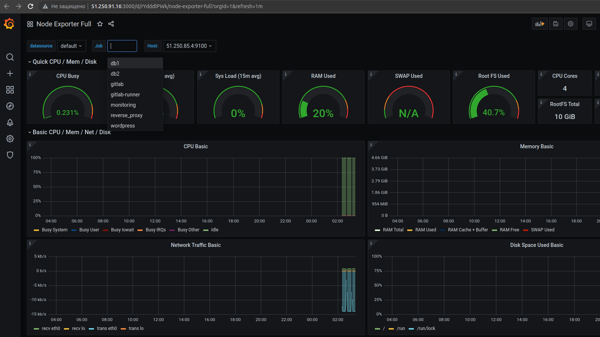
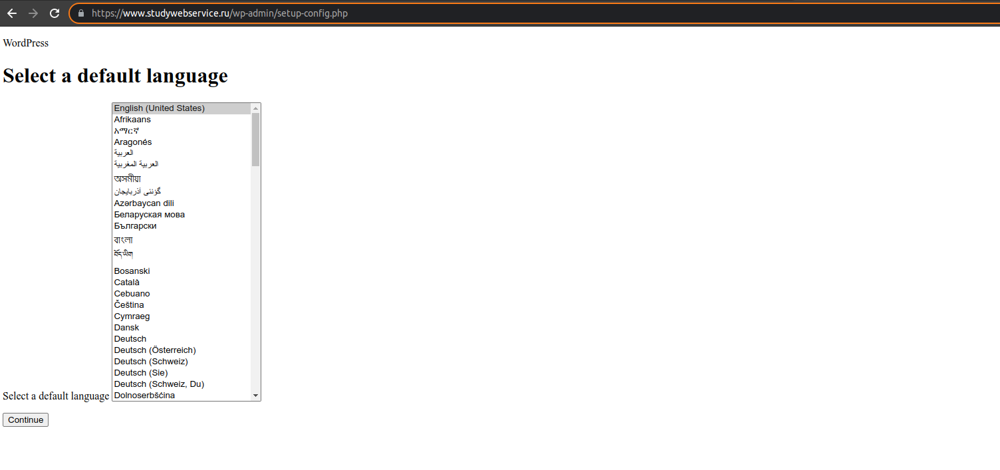
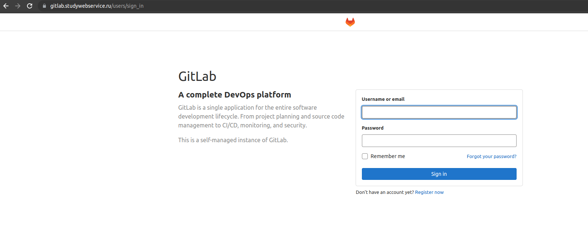
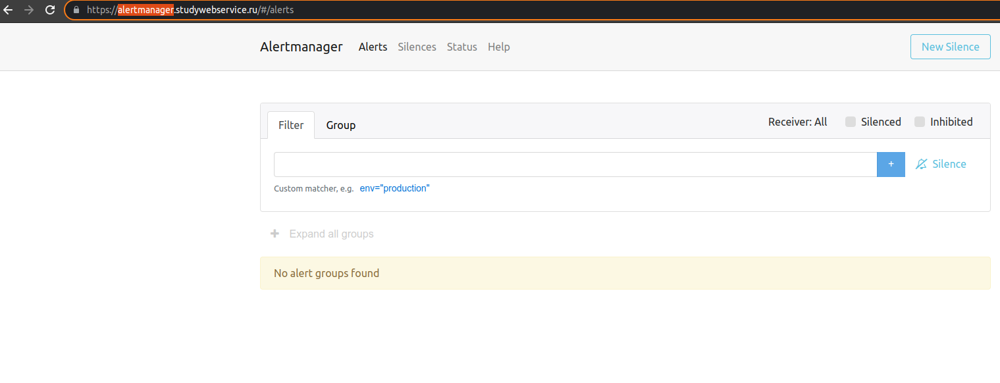

# devops-netology

## Дипломное задание по курсу «DevOps-инженер»

1. Регистрация доменного имени.
<br/>
Выполнено. Зарегистрирован домен на reg.ru studywebservice.ru. Имеется доступ к личному кабинету, а также возможность управлять доменом.

2. Создание инфраструктуры.
<br/>
Создан сервисный аккаунт service-user. Подготовлен Backend для Terraform (использовал вариант S3 bucket в созданном YC аккаунте). Создал 2 воркспейса - stage и prod.

```commandline
constantine@constantine:~/netology devops/Diploma/files/terraform$ terraform init -backend-config=backend.conf

Initializing the backend...

Successfully configured the backend "s3"! Terraform will automatically
use this backend unless the backend configuration changes.

Initializing provider plugins...
- Finding latest version of yandex-cloud/yandex...
- Installing yandex-cloud/yandex v0.76.0...
- Installed yandex-cloud/yandex v0.76.0 (self-signed, key ID E40F590B50BB8E40)

Partner and community providers are signed by their developers.
If you'd like to know more about provider signing, you can read about it here:
https://www.terraform.io/docs/cli/plugins/signing.html

Terraform has created a lock file .terraform.lock.hcl to record the provider
selections it made above. Include this file in your version control repository
so that Terraform can guarantee to make the same selections by default when
you run "terraform init" in the future.

Terraform has been successfully initialized!

You may now begin working with Terraform. Try running "terraform plan" to see
any changes that are required for your infrastructure. All Terraform commands
should now work.

If you ever set or change modules or backend configuration for Terraform,
rerun this command to reinitialize your working directory. If you forget, other
commands will detect it and remind you to do so if necessary.
constantine@constantine:~/netology devops/Diploma/files/terraform$ terraform workspace new stage
Created and switched to workspace "stage"!

You're now on a new, empty workspace. Workspaces isolate their state,
so if you run "terraform plan" Terraform will not see any existing state
for this configuration.
constantine@constantine:~/netology devops/Diploma/files/terraform$ terraform workspace new prod
Created and switched to workspace "prod"!

You're now on a new, empty workspace. Workspaces isolate their state,
so if you run "terraform plan" Terraform will not see any existing state
for this configuration.

```
После чего создал VPC в файле network.tf и добавил две подсети для зон ru-central1-a и ru-central1-b. Terraform plan и terraform destroy выполняются без ошибок.

Отдельно создал файл inventory.tf, в который будут добавляться описание ресурсов "local_file" с публичными ip-адресами и способами соединения, передаваемые в директорию inventory ansible роли для автоматизации и удобства процесса ее запуска.

```
constantine@constantine-3570R-370R-470R-450R-510R-4450RV:~/netology devops/Diploma/files/terraform$ terraform apply
Terraform used the selected providers to generate the following execution plan. Resource actions are indicated with the following symbols:
  + create

Terraform will perform the following actions:

  # yandex_compute_instance.vm-1[0] will be created
  + resource "yandex_compute_instance" "vm-1" {
      + created_at                = (known after apply)
      + folder_id                 = (known after apply)
      + fqdn                      = (known after apply)
      + hostname                  = "vm-1.netology.cloud"
      + id                        = (known after apply)
      + metadata                  = {
          + "ssh-keys" = <<-EOT EOT
        }
      + name                      = "vm-1"
      + network_acceleration_type = "standard"
      + platform_id               = "standard-v1"
      + service_account_id        = (known after apply)
      + status                    = (known after apply)
      + zone                      = "ru-central1-a"

      + boot_disk {
          + auto_delete = true
          + device_name = (known after apply)
          + disk_id     = (known after apply)
          + mode        = (known after apply)

          + initialize_params {
              + block_size  = (known after apply)
              + description = (known after apply)
              + image_id    = "fd8qs44945ddtla09hnr"
              + name        = "root-node01"
              + size        = 10
              + snapshot_id = (known after apply)
              + type        = "network-nvme"
            }
        }

      + network_interface {
          + index              = (known after apply)
          + ip_address         = (known after apply)
          + ipv4               = true
          + ipv6               = (known after apply)
          + ipv6_address       = (known after apply)
          + mac_address        = (known after apply)
          + nat                = true
          + nat_ip_address     = (known after apply)
          + nat_ip_version     = (known after apply)
          + security_group_ids = (known after apply)
          + subnet_id          = (known after apply)
        }

      + placement_policy {
          + host_affinity_rules = (known after apply)
          + placement_group_id  = (known after apply)
        }

      + resources {
          + core_fraction = 100
          + cores         = 2
          + memory        = 2
        }

      + scheduling_policy {
          + preemptible = (known after apply)
        }
    }

  # yandex_vpc_subnet.subnet_a will be created
  + resource "yandex_vpc_subnet" "subnet_a" {
      + created_at     = (known after apply)
      + folder_id      = (known after apply)
      + id             = (known after apply)
      + labels         = (known after apply)
      + name           = "subnet_a"
      + network_id     = "enpku31oeiilja1vc19s"
      + v4_cidr_blocks = [
          + "192.168.101.0/24",
        ]
      + v6_cidr_blocks = (known after apply)
      + zone           = "ru-central1-a"
    }

  # yandex_vpc_subnet.subnet_a will be created
  + resource "yandex_vpc_subnet" "subnet_b" {
      + created_at     = (known after apply)
      + folder_id      = (known after apply)
      + id             = (known after apply)
      + labels         = (known after apply)
      + name           = "subnet_b"
      + network_id     = "enpku31oeiilja1vc19s"
      + v4_cidr_blocks = [
          + "192.168.54.0/24",
        ]
      + v6_cidr_blocks = (known after apply)
      + zone           = "ru-central1-b"
    }

Plan: 3 to add, 0 to change, 1 to destroy.

Changes to Outputs:
  + external_ip_address_vm1_yandex_cloud = [
      + (known after apply),
    ]
  + internal_ip_address_vm1_yandex_cloud = [
      + (known after apply),
    ]

Do you want to perform these actions in workspace "stage"?
  Terraform will perform the actions described above.
  Only 'yes' will be accepted to approve.

  Enter a value: yes

yandex_vpc_subnet.subnet_b: Destroying... [id=e2lp23v0rrgkkepaih07]
yandex_vpc_subnet.subnet_a: Creating...
yandex_vpc_subnet.subnet_a: Creation complete after 10s [id=e9bqpke3q0i13dfvlna5]
yandex_vpc_subnet.subnet_b: Still destroying... [id=e2lp23v0rrgkkepaih07, 10s elapsed]
yandex_vpc_subnet.subnet_b: Destruction complete after 12s
yandex_vpc_subnet.subnet_b: Creating...
yandex_vpc_subnet.subnet_b: Creation complete after 1s [id=e2l2ua1fmrdbgc06em8f]
yandex_compute_instance.vm-1[0]: Creating...
yandex_compute_instance.vm-1[0]: Still creating... [10s elapsed]
yandex_compute_instance.vm-1[0]: Still creating... [20s elapsed]
yandex_compute_instance.vm-1[0]: Still creating... [30s elapsed]
yandex_compute_instance.vm-1[0]: Creation complete after 35s [id=fhm95ffdrcs6ltt246hp]

Apply complete! Resources: 3 added, 0 changed, 1 destroyed.

Outputs:

external_ip_address_vm1_yandex_cloud = [
  "62.84.114.132",
]
internal_ip_address_vm1_yandex_cloud = [
  "192.168.101.16",
]

```

3. Установка Nginx и LetsEncrypt

Создал отдельную виртуальную машину, а также playbook и ansible-роль для установки nginx, certbot и python3-certbot-nginx, а также добавления специально подготовленного www.studywebservice.ru.conf файла для nginx. 
Создал предварительно файл inventory.tf для автоматической генерации inventory для playbook. После отработки playbook 
запустил генерацию сертификатов для DNS-записей используя команду 
`sudo certbot --nginx --test-cert -d studywebservice.ru -d www.studywebservice.ru -d alertmanager.studywebservice.ru -d gitlab.studywebservice.ru -d grafana.studywebservice.ru -d prometheus.studywebservice.ru`.
После этого, добавил upstream и настройки обратного прокси для каждого DNS. Вариант конфига на текущий момент представлен в файле [nginx.conf](./nginx.conf).
После перезапуска nginx при открытии в браузуре любой DNS-записи отображается 502 ошибка


4. Установка кластера MySQL

Создал ресурс из 2 ВМ для master и clave реплик для кластера MySQL, используя terraform, а также отдельный ресурс 
local_file mysql_vars.tf для создания переменных по умолчанию для слейва для ansible-роли, в который автоматически помещается адрес мастера, 
после чего создал 3 ansible-роли - первая для общей установке MySQL на ВМ (включая создание пользователя wordpress), 
остальные для конфигурирования мастера (включая создание БД wordpress) и слейва. В первой мы создаем БД wordpress, REPLICATION SLAVE пользователя и 
копируем подготовленный mysqld.cnf. Во второй мы также копируем mysqld.cnf плюс конфигурируем репликацию, указывая 
основные параметры для нее. `Вывод команды show slave status;`


Как видно, подключение со слейв-машины на мастер прошло успешно. Также репликация была успешно протестирована на примере
создания таблиц и баз данных на мастере и автоматический перенос их на слейв.


5. Установка WordPress

Выполнено. Создана ВМ для Wordpress и Apache2. В terraform добавлено создание ресурса local_file wordpress (файл wordpress_vars.tf), 
который создает yml-файл дефолтных переменных (включая IP-адрес мастера БД созданной ранее) для ansible-роли. 
Создана роль для их установки. При переходе по внешнему IP-адресу либо домену открывается главная страница Wordpress.


6. Установка Gitlab CE и Gitlab Runner

Создал ресурсы и роли для установки gitlab и gitlab runner. После установки зашел в gitlab под рутом, найдя его через команду `sudo nano /etc/gitlab/initial_root_password`, 
создал тестовый проект, затем на сервере с установленным runner'ом зарегистрировал его для установленного gitlab'а. Создал ssh ключи для доступа к серверу app.studywebservice.ru и
добавил приватный ключ в переменную SSH_PRIVATE_KEY (repository > settings > CI/CD > Variables), публичный же добавил в ~/.ssh/authorized_keys сервера app.studywebservice.ru. Создал pipeline для доставки файлов при любом коммите и создании тега 
([gitlab-ci.yml](./gitlab-ci.yml) пайплайна присутствует во вложении).


7. Установка Prometheus, Alert Manager, Node Exporter и Grafana

Создал роль для установки docker и node exporter. Роли запускаются ansible'ом на всех серверах. 
Создал роль monitoring для установки grafana, alert manage и prometheus. Добавил правила для алерт менеджера, добавил в 
терраформ ресурс local_file (файл prometheus_config.tf) для создания prometheus.yml, в который инжектятся ip-адреса серверов, где установлен node exporter, 
а также мониторинга графаны, alert manager'а и самого prometheus. При создании инфраструктуры конфиг автоматически добавляется в файлы роли monitoring.
При открытии графаны доступен дашборд отображающий метрики из Node Exporter по всем серверам.



## Итог

Скриншоты веб-интерфейсов всех сервисов

Для Wordpress не приходят стили из-за того возникает ошибка смешанных запросов (mixed content was loaded over https but requested an insecure script), 
т.е. запросы уходят по HTTP, а не по HTTPS. Судя по всему это связано с тем, что фронтенд отправляет их некорректно. Ошибка правится плагинами, либо нужно исправлять код самого Wordpress.

### studywebservice.ru


### www.studywebservice.ru



### gitlab.studywebservice.ru



### grafana.studywebservice.ru


### prometheus.studywebservice.ru


### alertmanager.studywebservice.ru



## Ссылки

[ansible](https://github.com/Constantin174/netology-diploma-ansible)

[terraform](https://github.com/Constantin174/netology-diploma-terraform)
