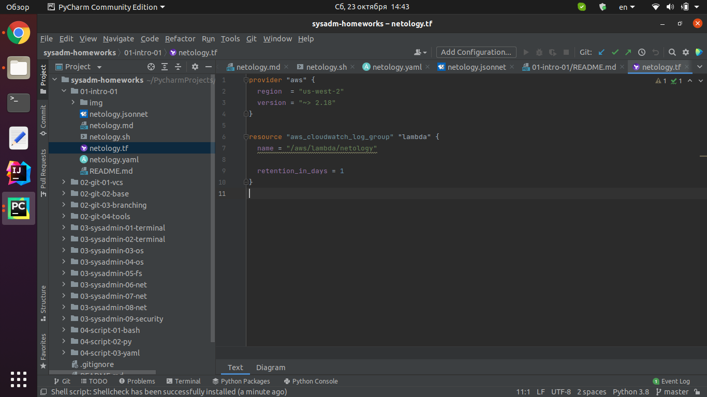
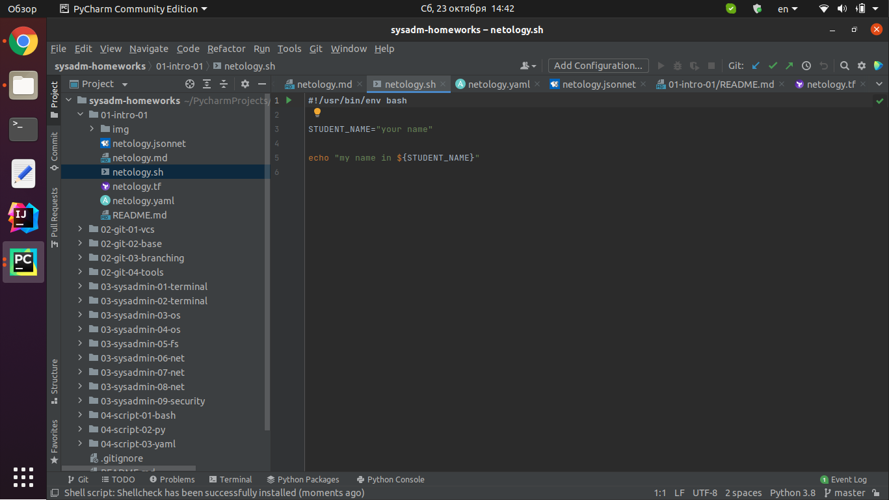
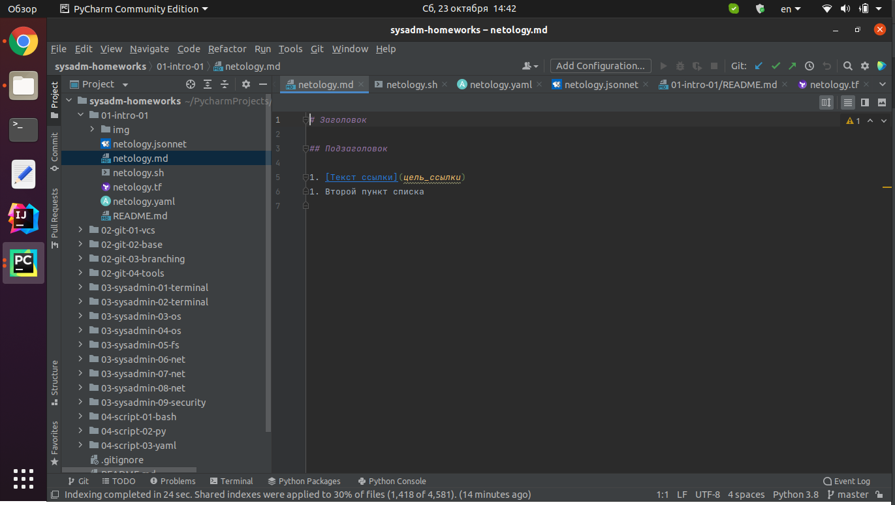
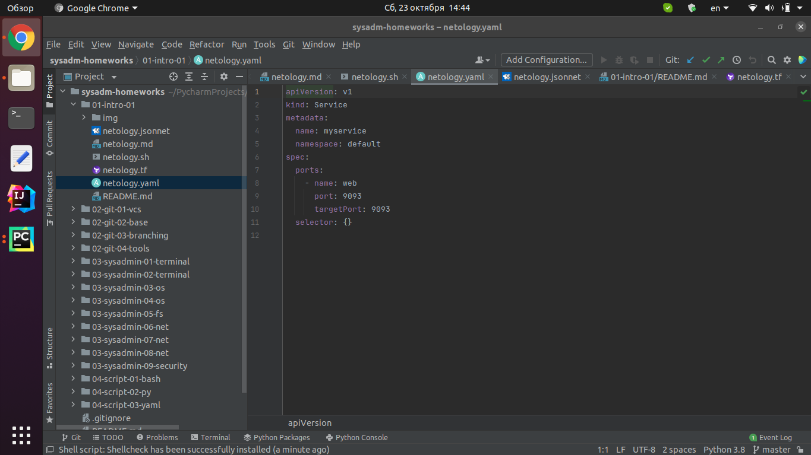
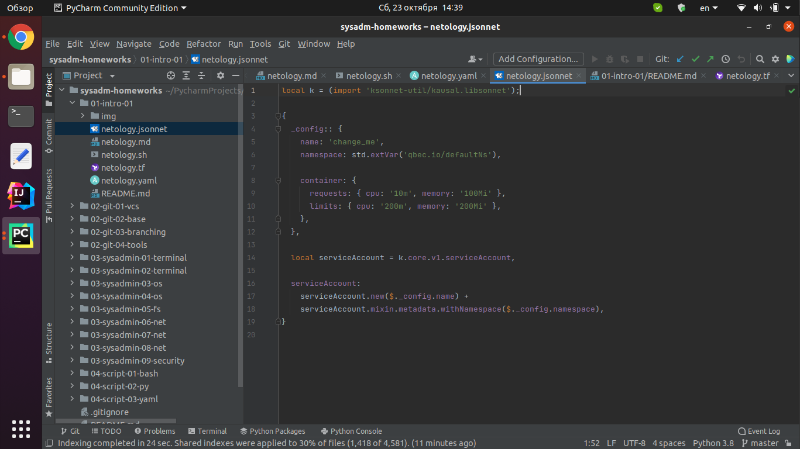

# Домашнее задание к занятию «1.1. Введение в DevOps»

## Задание №1 - Подготовка рабочей среды.

Проверка синтаксиса:
    - Terraform: 
    - Bash: 
    - Markdown: 
    - Yaml: 
    - Jsonnet: 

## Задание №2 - Описание жизненного цикла задачи (разработки нового функционала)

Основная цель для успешного выполнения реализации определенной задачи - это в первую очередь грамотное выстраивание процессов связанных с взаимодействием между основными участниками, которые работают над ее выполнением. Также, важным моментом является возможность их (процессов) автоматизации.

В рамках реализации задачи необходимо реализовать распределение ролей ее участников:

- менеджеры отвечают за проработку бизнес-логики на основании требований заказчика, а также участвуют в формировании ТЗ;
- разработчики участвуют в реализации решения на всех этапах (формирование архитектуры, написание нового кода и поддержка существующего, интеграция с другими сервисами), покрытием разработанного функционала тестами (юнит и интеграционными);
- тестировщики занимаются тестированием функционала с точки зрения его бизнес-логики (UI, API, базы данных) с возможностью использования как ручного, так и автоматизированного тестирования;
- devops-инженеры участвуют в создании гибкой и отказоустойчивой инфраструктуры, а также в поддержании ее рабочего состояния, автоматизации процессов развертывания и мониторинга работы сервисов, тестирования функционала, развертывание и поддержка тестовых стендов на уровне инфраструктуры и пр.

Также важной частью является поддержка коммуникации между различными отделами, реализуемая в рамках использования, например, регулярно проводимых стендапов.